# Section 08: The Problems - Python's Packaging Pain Points (2000-2016)

> From packaging chaos to industry leadership through standardization

## What Made Python Packaging So Painful?

**The Four Core Problems** (ordered by cause and effect):

### 1. **📚 Community and Tool Fragmentation**
*Root cause: No official standards, slow PEP development*
- **No official packaging standard**: Python core team remained neutral on tooling choices
- **PEP specifications came too late**: PEP 517/518 (2016-2017), PEP 621 (2020), PEP 751 (2025)
- **Fragmented tool ecosystem**: Everyone built competing, incompatible solutions
- **No official guide until 2013**: PyPUG came too late to prevent fragmentation
- **Impact**: Led to fragmented community AND fragmented tooling ecosystem

### 2. **🎯 No Unified Environment and Dependency Management Solution**
*The pain point: Different tools for different project types*
- **Libraries**: setup.py + twine + PyPI (complex but functional)
- **Applications**: requirements.txt + pip (primitive and error-prone)
- **Data Science**: conda + environment.yml (incompatible with PyPI)
- **Missing lock files**: No way for libraries to support application lock file workflows
- **Impact**: Ecosystem fragmentation, no single solution

### 3. **🔧 Executable setup.py**
*Technical debt: Blocked tooling automation*
- **Arbitrary code execution**: Installing packages could run anything (security risk)
- **Dynamic metadata**: Tools couldn't analyze without executing (auditing impossible)
- **No static analysis or editing**: Tools couldn't parse or modify metadata without code execution
- **Impact**: Prevented development of automated tooling for environment and dependency management

### 4. **🏚️ Environment Management Hell**
*Daily friction: Manual processes everywhere*
- **No auto version switching**: pyenv existed (2011) but required manual setup, unlike Ruby's automatic `.ruby-version` (2009)
- **Manual activation nightmare**: `source venv/bin/activate` vs automatic project isolation
- **Python version chaos**: System Python? pyenv? conda? Docker? All conflicting
- **Impact**: Daily friction for every developer, caused by lack of automated tooling

## Python's Transformation: From Worst to Best (2017-2025)

**The Turning Point: PEP 518 (2017)**
- **pyproject.toml foundation**: First standard declarative configuration format
- **End of executable setup.py era**: Tools could finally parse metadata statically
- **Modern tool explosion**: Poetry, PDM, Hatch, and uv all built on this foundation


### Python's Development Timeline: Problem Periods and Solutions

**Tool Status Legend**:
- 🟩 **Green (Stable)**: Mature tools still in active use
- 🟦 **Blue (Active)**: Modern tools gaining adoption
- 🟥 **Red (Deprecated)**: Legacy tools no longer recommended
- ⚪ **Milestones**: Key feature breakthroughs in packaging evolution


### Multi-Language Ecosystem Comparison: Timeline Summary

| **Feature** | **Java** | **Ruby** | **Node.js** | **Rust** | **Go** | **Python Before** | **Python 2025** |
|------------|----------|----------|-------------|----------|---------|-------------------|-----------------|
| **🎯 Unified Workflow** | Maven<br/>(2004) | Bundler<br/>(2010) | npm<br/>(2010) | Cargo<br/>(2015) | go mod<br/>(2018) | ❌ Split tools<br/>(apps vs libs) | ✅ **uv**<br/>(2024) |
| **📌 Version Management** | JVM handles | rvm/rbenv<br/>(2009) | nvm<br/>(2010) | rustup<br/>(2016) | Built-in | ❌ Manual install | ✅ **uv python**<br/>(2024) |
| **🔒 Lock Files** | POM versions | Gemfile.lock<br/>(2010) | package-lock<br/>(2017) | Cargo.lock<br/>(2015) | go.sum<br/>(2018) | ❌ pip freeze mess | ✅ **PEP 751**<br/>(2025) |
| **🔄 Auto Env Switch** | Not needed | ✅ Since 2012 | .nvmrc<br/>(2013) | Built-in | Not needed | ❌ Manual activate | ✅ **uv auto**<br/>(2024) |
| **📝 Declarative Config** | pom.xml<br/>(2004) | Gemfile<br/>(2010) | package.json<br/>(2010) | Cargo.toml<br/>(2015) | go.mod<br/>(2018) | ❌ setup.py code | ✅ **pyproject.toml**<br/>(2021) |

**The Pattern**: Languages that succeeded had **unified tools from the start**. Python's 2025 transformation through uv + standardization is **beginning to approach** other languages' experience.

## How Python's Gaps Hurt

### 🔧 No Unified Workflow: Missing Lock File Integration

**The Core Problem**: Library and application workflows couldn't integrate due to missing lock file ecosystem

**Why Python Tools Were Functional But Fragmented**:
- **setup.py + extras_require worked well** but missing lock files meant no integration with application workflows
- **requirements.txt + pip freeze worked** but had terrible developer experience (tedious manual maintenance)
- **conda solved system dependencies** but created a separate incompatible ecosystem

**The Missing Link: Lock Files Enable Library-Application Integration**

*Applications - Manual requirements.txt hell:*
```txt
# requirements.txt - no connection to library dependency groups
Django==4.1.0       # Can't leverage Django's optional dependencies
pytest==6.0         # Manual management, no library integration
black==21.0
-r requirements.txt  # Manual inclusion, error-prone
```

*Libraries - extras_require worked but isolated:*
```python
setup(
    name='mylib',
    install_requires=['requests>=2.0'],
    extras_require={
        'dev': ['pytest>=6.0', 'black>=21.0'],  # ✅ This actually worked well
        'docs': ['sphinx>=3.0'],                # But couldn't integrate with app lock files
    }
)
```

**Why Lock Files Matter for Unification**:
- **Without lock files**: Libraries can't contribute to application dependency management
- **With lock files**: Library dependency groups can integrate with application workflows
- **Result**: Missing lock file standard meant library and application worlds stayed separate

**Other languages had unified approaches from the start**:
- **Java (2004)**: Maven scopes work for all project types
- **Node.js (2010)**: `devDependencies` work for all project types
- **Ruby (2010)**: Gemfile groups work for all project types

### 💔 Developer Experience: Python vs Other Languages

**What developers from other languages experienced when joining Python teams:**

**Java developer (2016)**:
> "In Java, I run `mvn install` and everything works. In Python, I need 6 different tools, 3 virtual environments, and a PhD in package management just to run the application."

**Ruby developer (2018)**:
> "Ruby has had Bundler since 2010. I just run `bundle install` and everything works - dependencies, lock files, dev groups. Python in 2018 still feels like 2005."

**Go developer (2020)**:
> "Go modules just work. `go mod tidy` handles everything. Why does Python require so many tools just to manage dependencies?"

**The workflow comparison:**

**Python 2012** - 🔴 Manual hell:
```bash
sudo apt-get install python3.6  # or pyenv install + pyenv local (manual setup)
virtualenv venv
source venv/bin/activate
pip install -r requirements.txt
```

**Ruby 2012** - 🟢 Automatic:
```bash
cd project/  # reads .ruby-version
bundle install
```

**Node 2013** - 🟢 Project isolated:
```bash
nvm use  # reads .nvmrc
npm install
```

### 🔧 Setup.py: Security and Tooling Problems

**The Problem**: setup.py was executable code, not data
- Security risk: arbitrary code execution during install
- Tooling blocker: IDEs couldn't parse package metadata
- Dependency analysis required code execution

**Other languages used declarative formats**:
- **Java (2004)**: XML configuration
- **Node.js (2010)**: JSON metadata
- **Ruby (2010)**: Restricted DSL

## Summary: The Scope of Python's Packaging Problems

### The Cascade Effect: How Problems Led to Daily Pain

```mermaid
---
config:
  theme: neutral
  themeVariables:
    primaryColor: '#ff6b6b'
    primaryTextColor: '#000000'
    primaryBorderColor: '#ff4757'
    lineColor: '#2f3542'
    secondaryColor: '#ffa502'
    tertiaryColor: '#70a1ff'
---
flowchart TD
    A["📚 Community & Tool<br/>Fragmentation<br/>🔴 Root Cause"]

    B["🎯 No Unified<br/>Solution<br/>💥 Real Pain Point"]

    C["🔧 Executable<br/>setup.py<br/>⚙️ Tooling Blocker"]

    D["🏚️ Environment<br/>Management Hell<br/>😫 Daily Friction"]

    A -->|"Fragmented solutions"| B
    A -->|"No standardization"| C
    B -->|"No automation"| D
    C -->|"Blocked tooling"| D

    style A fill:#ff6b6b,stroke:#ff4757,stroke-width:3px,color:#000000
    style B fill:#ffa502,stroke:#ff6348,stroke-width:3px,color:#000000
    style C fill:#70a1ff,stroke:#5352ed,stroke-width:3px,color:#000000
    style D fill:#ff9ff3,stroke:#f368e0,stroke-width:3px,color:#000000
```



These four core problems created a **cascade effect** that made Python packaging uniquely difficult:

1. **📚 Community and Tool Fragmentation** - Root cause: No official standards, slow PEP development
2. **🎯 No Unified Environment and Dependency Management Solution** - The real pain point: Different tools for different project types
3. **🔧 Executable setup.py** - Blocked tooling automation and created security risks
4. **🏚️ Environment Management Hell** - Result: Daily friction for every developer due to manual processes

**The Result**: While other languages had unified workflows by 2010-2012, Python developers struggled with fragmented tooling until PEP 518 (2017) provided the foundation for modern tools.

---

**Next Section**: [07-the-root-causes-why-python-fell-behind.md](07-the-root-causes-why-python-fell-behind.md) - The Root Causes: Why Python fell behind & how it caught up
**Previous Section**: [05-module-subpackage-design.md](05-module-subpackage-design.md) - Module & subpackage design