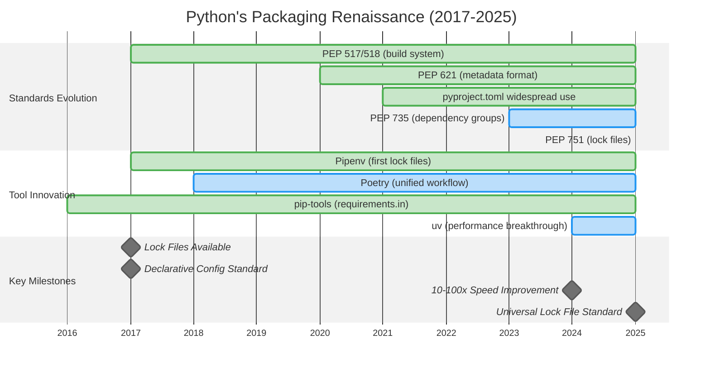

# Section 09: The Root Causes - Why Python Fell Behind & How It Caught Up

## High-Level Overview: Why Python Fell Behind

Python's packaging ecosystem lagged 10+ years behind other languages due to **five root causes** that created a vicious cycle of poor tooling:

### The Five Root Causes

| Root Cause | Python Reality | Other Languages | Impact |
|------------|----------------|-----------------|---------|
| **1. Leadership Vacuum** | No BDFL support, no corporate backing | Java (Oracle), Ruby (Rails), Node (npm Inc.) | No unified direction |
| **2. Cultural Inertia** | "Scripts are good enough" mentality | Production-first mindset | Accepted inferior tools |
| **3. Community Fragmentation** | Web vs Data Science vs DevOps | Unified developer base | Conflicting solutions |
| **4. Technical Debt** | Executable setup.py, no standards | Declarative configs from start | Blocked modern tooling |
| **5. Framework Neutrality** | Django/Flask stayed neutral | Rails enforced best practices | No adoption pressure |

## Part 1: The Leadership Crisis

### Python's "Freedom of Choice" Philosophy Backfired

**The Philosophy Gap**:
- **Python**: "We're all consenting adults" → Everyone built their own solutions
- **Ruby**: "Convention over configuration" → Rails dictated the One True Way™
- **Node.js**: "Batteries included" → npm shipped with Node from day 1
- **Result**: Python had 10 different "right ways" while others had one

### No Corporate Champion

| Language | Corporate Backing | Result |
|----------|------------------|---------|
| Java | Sun/Oracle drove Maven | ✅ Unified ecosystem by 2004 |
| JavaScript | npm Inc. coordinated | ✅ Standard tooling by 2010 |
| Ruby | 37signals (Rails) led | ✅ Bundler adoption by 2010 |
| Python | No major sponsor | ❌ Fragmented until 2020s |

**Impact**: Without leadership, Python couldn't achieve consensus on basic workflows that other languages standardized in their first 5 years.

## Part 2: Cultural Barriers - The "Script Mentality"

### Early Adopter Problem

**Python's First Users (2000-2015)**:
- **Primary audience**: Researchers, data scientists, system administrators
- **Use cases**: Quick scripts, data analysis, automation
- **Engineering maturity**: Limited exposure to production systems
- **Comparison baseline**: Coming from MATLAB, R, or shell scripts

**Why This Mattered**:
```
MATLAB User → Python: "Wow, pip is so much better than manual downloads!"
Ruby Developer → Python: "Wait, no Bundler equivalent? This is prehistoric!"
```

### The Acceptance of Manual Processes

**What Python developers normalized**:
- ✅ "Just use system Python" (vs version managers)
- ✅ "requirements.txt is fine" (vs lock files)
- ✅ "Works on my machine" (vs reproducible builds)
- ✅ "pip install in global" (vs isolated environments)

**The cultural shift came when**:
- Web developers from Ruby/Node joined Python (2015+)
- ML moved to production systems (2018+)
- Enterprise demanded compliance (2020+)

## Part 3: Community Fragmentation

### Three Pythons, Three Philosophies

| Community | Tools | Approach | Problems |
|-----------|-------|----------|----------|
| **Web Developers** | Django/Flask + pip + venv | Simple PyPI packages | Ignored system dependencies |
| **Data Scientists** | Jupyter + conda + environment.yml | System + Python packages | Incompatible with pip ecosystem |
| **DevOps/SysAdmins** | Scripts + system Python + OS packages | Avoid Python packaging | No isolation, version conflicts |

**Each community built incompatible solutions**:
- **Web**: Focused on pip/PyPI, ignored system dependencies
- **Data Science**: Created conda, incompatible with pip  
- **DevOps**: Relied on OS packages, avoided Python packaging

**Result**: No unified workflow could satisfy all communities → decade of fragmentation.

## Part 4: Technical Debt - The setup.py Disaster

### Why Executable Config Blocked Progress

**The setup.py Problem**: Installing Python packages meant executing arbitrary code.

```python
# Example: Dynamic dependencies based on environment
import os
if os.environ.get('PROD'):
    install_requires = ['django>=3.0']  # 🚨 Code execution during install!
else:
    install_requires = ['django>=2.0']
```

**Four Cascading Problems**:

| Problem | Impact | Modern Solution |
|---------|---------|-----------------|
| **Security Risk** | Untrusted code execution during install | Declarative config only |
| **No Static Analysis** | Tools can't read metadata without execution | Parse config files directly |
| **No Caching** | Every operation re-runs setup.py | Static metadata caching |
| **IDE Integration** | Can't parse dynamic configuration | Standard config format |

**Timeline: Declarative Config Adoption**:
- **Java (2004)**: pom.xml - pure XML
- **Ruby (2010)**: Gemfile - restricted DSL  
- **Node (2010)**: package.json - pure JSON
- **Python (2021)**: pyproject.toml - finally caught up!

## Part 5: Framework Philosophy - The Rails Effect

### How Framework Leadership Shapes Ecosystems

**Rails Forced Best Practices (2010)**:
```ruby
# Every Rails tutorial starts with:
$ bundle install  # No alternatives shown
```

**Django Preserved Choice (2025)**:
```python
# Django docs still show:
$ pip install -r requirements.txt  # or
$ poetry install  # or
$ pipenv install  # or...
```

**Impact on Adoption**:
- **Rails developers**: 100% use Bundler (no choice)
- **Django developers**: Split across pip, Poetry, Pipenv, uv
- **Result**: Python best practices remain "expert knowledge" not "default behavior"

## Why Python Started Catching Up (2017-2025)

### The Perfect Storm of Change

**Key Innovation Milestones:**

**2017 - Pipenv: Lock Files Breakthrough**
- **Proved lock files were viable**: First tool to successfully implement Pipfile.lock
- **Showed demand existed**: Despite performance issues, gained rapid adoption
- **Validation of concept**: Demonstrated that Python developers wanted better dependency management

**2018 - Poetry: Unified Workflow Vision**
- **All-in-one approach**: Combined dependency management, building, and publishing
- **Cargo-inspired design**: Brought Rust's integrated tooling concepts to Python
- **Proved unified workflow possible**: Showed Python could have integrated tools like other languages

**2024 - uv: Performance Revolution**
- **Speed breakthrough**: 10-100x faster than existing tools
- **Rust-powered reliability**: Modern systems programming language advantages
- **Universal adoption potential**: Finally made good practices faster than shortcuts



### Three Critical Factors Aligned

**1. External Pressure Reached Critical Mass**:
- Developers with Java/Ruby/Node experience demanded better
- ML models needed production deployment
- Enterprise compliance required reproducibility

**2. Technical Standards Matured**:
- PEP 517/518/621 created interoperable foundation
- pyproject.toml replaced setup.py
- Lock file standards (PEP 751) enabled tool compatibility

**3. Tool Innovation Breakthrough**:
- **Poetry**: Proved unified workflow was possible
- **uv**: Made proper packaging faster than shortcuts
- **Result**: Good practices became the easy path

## Current Challenges (2025): Why Full Adoption Remains Incomplete

### 1. Framework Inertia

**Documentation still shows old patterns**:
- Django tutorials: requirements.txt (2005 approach)
- Flask guides: Mixed pip/Poetry examples
- FastAPI: Multiple options without clear preference

**Why frameworks resist change**:
- Backward compatibility commitments
- Diverse user base (beginners → experts)
- Avoid "picking winners" among tools

### 2. Ecosystem Fragmentation Persists

**Three incompatible package management worlds in 2025**:

| Ecosystem | Tools | Focus | Limitations |
|-----------|-------|-------|-------------|
| **Standard Python** | uv, pip, Poetry | Pure Python packages | Can't handle system dependencies |
| **Data Science** | conda, mamba | System + Python packages | Conflicts with PyPI ecosystem |
| **System Level** | apt, yum, brew | OS-level packages | No Python version isolation |

**The conda divide**:
- **PyPI**: Pure Python packages  
- **conda**: System dependencies + Python
- **Result**: Two incompatible ecosystems that can't be easily unified

### 3. Legacy System Lock-in

**Adoption barriers**:
- Millions of projects using requirements.txt
- CI/CD pipelines built around pip
- Corporate approval processes for new tools
- Migration costs vs immediate benefits

### 4. No Official Tool Blessing

**Official Python stance (2025)**: *"We provide standards. The community provides tools."*

**Current tool landscape**:

| Tool | Status | Strengths | Weaknesses |
|------|--------|-----------|------------|
| **pip** | Official | Stable, universal | Limited features |
| **Poetry** | Popular | User-friendly | Non-standard |
| **uv** | Rising | Fastest | Too new |
| **Pipenv** | Declining | Pioneer | Stagnant |

**Impact of no official blessing**:
- New developers face choice paralysis
- Teams debate tool selection endlessly  
- No universal "getting started" guide
- Community remains fragmented despite standards

## Future Outlook: The Path Forward

### Near-term (2025-2027)

**Likely developments**:
1. **uv becomes de facto standard** through speed + standards compliance
2. **Frameworks gradually adopt** modern practices in documentation
3. **Lock files (PEP 751)** achieve universal adoption
4. **Corporate adoption** accelerates with proven tools

### Medium-term Challenges

**Unsolved problems**:
1. **System package integration**: conda vs PyPI divide
2. **Official tool blessing**: Python core team remains neutral
3. **Migration assistance**: Tools for legacy project conversion
4. **Cross-platform complexity**: Windows/Linux/Mac differences

### The Lesson for Developers

**Python's journey teaches**:
- **Standards without tools** → Limited adoption
- **Tools without standards** → Fragmentation
- **Standards + mature tools** → Ecosystem transformation

**Key insight**: Python needed both standardization (PEPs) AND user-friendly tools (uv) to finally catch up. Neither alone was sufficient.

---

**The Bottom Line**: Python's packaging evolved from "worst in class" (2015) to "approaching best in class" (2025) through painful lessons about leadership, standards, and tool usability. While challenges remain, the ecosystem has fundamentally transformed from chaos to increasingly mature, standardized tooling.

---

**Next Section**: [08-the-solutions-modern-python-tools.md](08-the-solutions-modern-python-tools.md) - The Solutions: Modern Python tools & best practices  
**Previous Section**: [06-the-problems-python-packaging-pain-points.md](06-the-problems-python-packaging-pain-points.md) - The Problems: Python's packaging pain points