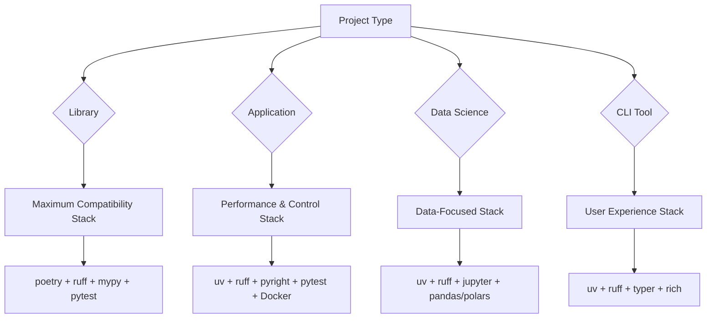
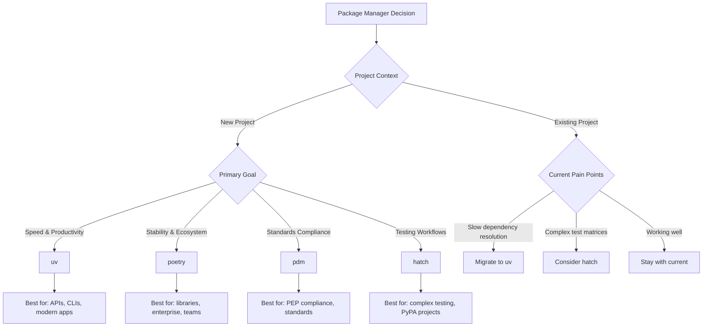

# Python Tools 2025: The Modern Developer's Arsenal

## 🎯 Strategic Tool Selection Framework

Modern Python development success depends on **tool integration over individual tool choice**. The key is understanding how tools complement each other within specific workflows and project types.

### The Integration Principle



### Decision Framework: Choose Your Stack

| Project Type | Primary Goal | Recommended Stack | Key Trade-offs |
|--------------|--------------|-------------------|----------------|
| **Library** | Compatibility | poetry + pytest + sphinx | Stability > Speed |
| **Web API** | Performance | uv + FastAPI + pytest-asyncio | Speed > Compatibility |
| **Data Science** | Iteration Speed | uv + jupyter + polars | Flexibility > Reproducibility |
| **CLI Application** | User Experience | uv + typer + rich | Developer Experience > Size |
| **Enterprise App** | Reliability | poetry + Django + comprehensive testing | Stability > Latest Features |

## 📦 Package & Environment Management

### The Current Landscape

| Tool | Maturity | Speed | Features | Best For | Future Outlook |
|------|----------|-------|----------|----------|----------------|
| **uv** | 🟡 Growing Fast | ⚡ 10-100x faster | All-in-one | New projects, speed matters | 🚀 Likely winner |
| **poetry** | 🟢 Mature | 🐌 Baseline | Full-featured | Existing projects, stability | 📊 Stable |
| **pdm** | 🟡 Stable | 🚶 3-5x faster | Standards-focused | PEP compliance | 📈 Specialized |
| **hatch** | 🟡 Growing | 🚶 Moderate | Testing matrices | Complex testing workflows | 📈 PyPA-backed |
| **pip + venv** | 🟢 Mature | 🐌 Baseline | Basic | Simple scripts, legacy | 📉 Maintenance mode |

### Strategic Package Manager Selection



### Tool Comparison: Key Features

**uv (Recommended for 2025)**
```bash
# One tool for everything
uv init myproject
uv add pandas numpy
uv add --dev pytest ruff
uv run python main.py
uv build && uv publish
```
- ✅ 10-100x faster than pip
- ✅ Built-in Python management
- ✅ Standard pyproject.toml
- ⚠️ Still evolving rapidly

**poetry (Mature Alternative)**
```bash
poetry new myproject
poetry add pandas numpy
poetry add --group dev pytest ruff
poetry run python main.py
poetry build && poetry publish
```
- ✅ Battle-tested, stable
- ✅ Great dependency resolver
- ❌ Slower performance
- ❌ No Python management

## 🧹 Code Quality Tools

### Linting & Formatting: The Rust Revolution

| Tool | Category | Speed | Coverage | Replaces | Status |
|------|----------|-------|----------|----------|---------| 
| **ruff** | Linter + Formatter | ⚡ 100x | 90% | flake8, isort, black* | 🚀 Adopt now |
| **black** | Formatter | 🐌 Slow | Formatting | - | 📊 Still popular |
| **mypy** | Type Checker | 🐌 Slow | Types | - | 📈 Essential but painful |
| **pyright** | Type Checker | 🚶 Faster | Types | mypy | 📈 Growing |

### The New Workflow: Ruff + Type Checking

**Modern Setup (pyproject.toml)**
```toml
[project]
name = "myproject"
dependencies = ["fastapi", "pydantic"]

[project.optional-dependencies]
dev = ["ruff", "mypy", "pytest", "pytest-cov"]

[tool.ruff]
# Replaces: flake8, isort, pyupgrade, and more
line-length = 88
target-version = "py312"
select = [
    "E",    # pycodestyle errors
    "W",    # pycodestyle warnings  
    "F",    # pyflakes
    "I",    # isort
    "B",    # flake8-bugbear
    "C4",   # flake8-comprehensions
    "UP",   # pyupgrade
]

[tool.mypy]
python_version = "3.12"
strict = true
warn_return_any = true
```

**One Command for Everything**
```bash
# Format and lint in one go
ruff format .
ruff check . --fix

# Type checking (still separate)
mypy .
```

### Type Checking: The Painful Reality

**mypy**: The standard but...
- ✅ Most mature ecosystem
- ✅ Best library support
- ❌ Slow on large codebases
- ❌ Configuration hell
- 📝 Still essential for serious projects

**pyright/pylance**: The challenger
- ✅ Faster performance
- ✅ Better IDE integration
- ⚠️ Different type semantics
- ⚠️ Less library stubs

## 🧪 Testing Tools

### Testing Framework Landscape

| Tool | Purpose | Maturity | Use Case |
|------|---------|----------|----------|
| **pytest** | Test framework | 🟢 Mature | Everything |
| **pytest-cov** | Coverage | 🟢 Mature | Coverage reports |
| **pytest-xdist** | Parallel testing | 🟢 Mature | Speed up tests |
| **hypothesis** | Property testing | 🟡 Growing | Complex testing |
| **nox/tox** | Test automation | 🟢 Mature | Multi-env testing |

### Modern Testing Setup

```toml
[tool.pytest.ini_options]
minversion = "7.0"
addopts = [
    "--cov=myproject",
    "--cov-report=term-missing",
    "--cov-report=html",
    "-n=auto",  # parallel execution
]
testpaths = ["tests"]

[tool.coverage.run]
branch = true
source = ["myproject"]
```

## 🚀 Deployment & Distribution

### Application Deployment Tools

| Tool | Use Case | Complexity | Performance |
|------|----------|------------|-------------|
| **Docker + uv** | Containers | Medium | Fast builds |
| **PyInstaller** | Desktop apps | High | Large binaries |
| **Briefcase** | Cross-platform | High | Native apps |
| **Streamlit** | Data apps | Low | Quick deploy |

### Modern Docker + uv Example

```dockerfile
FROM python:3.12-slim

# Install uv
COPY --from=ghcr.io/astral-sh/uv:latest /uv /bin/uv

# Copy project files
WORKDIR /app
COPY pyproject.toml uv.lock ./

# Install dependencies (blazing fast!)
RUN uv sync --frozen --no-dev

# Copy application
COPY src ./src

# Run with uv
CMD ["uv", "run", "python", "-m", "myapp"]
```

## 🔍 Development Tools

### IDE & Editor Support

| Tool | Purpose | Best For |
|------|---------|----------|
| **VS Code + Pylance** | IDE | Most developers |
| **PyCharm** | IDE | Enterprise |
| **Neovim + LSP** | Editor | Power users |
| **Jupyter** | Notebooks | Data science |

### Python Version Management

| Tool | Features | Best For | Integration |
|------|----------|----------|-------------|
| **uv** | Built-in Python management | Modern workflows | Integrated with uv package manager |
| **pyenv** | Compile from source | Traditional setups | Shell integration, `.python-version` |
| **mise** | Pre-built binaries, multi-language | Performance-focused | Fast (Rust-based), `.mise.toml` |
| **asdf** | Plugin ecosystem | Multi-language teams | `.tool-versions` file |

### Documentation Tools

| Tool | Type | Use Case |
|------|------|----------|
| **mkdocs** | Static sites | Project docs |
| **sphinx** | API docs | Libraries |
| **pdoc** | Simple API | Quick docs |

## 📊 Domain-Specific Tool Stacks

### 📚 Library Development Stack


**Priority: Maximum Compatibility**
- **Package Manager**: `poetry` (mature ecosystem, stable)
- **Code Quality**: `ruff` (fast linting + formatting)
- **Type Checking**: `mypy` (broadest library support)
- **Testing**: `pytest` + `hypothesis` (property-based testing)
- **Documentation**: `sphinx` (API docs) or `mkdocs` (user guides)
- **Key Principle**: Support wide Python version range, flexible dependencies

### 🌐 Web API Development Stack


**Priority: Performance & Developer Experience**
- **Package Manager**: `uv` (blazing fast dependency resolution)
- **Framework**: `FastAPI` (async-first, type-driven)
- **Code Quality**: `ruff` + `pyright` (speed + IDE integration)
- **Testing**: `pytest-asyncio` + `httpx.AsyncClient`
- **Deployment**: `Docker` + `uv sync --frozen`
- **Key Principle**: Optimize for development speed and runtime performance

### 🔬 Data Science Stack


**Priority: Iteration Speed & Reproducibility**
- **Environment**: `uv` (pure Python) or `conda` (complex dependencies)
- **Notebooks**: `marimo` (reactive, Git-friendly) or `jupyter`
- **Data Processing**: `polars` (fast) or `pandas` (ecosystem)
- **Testing**: `pytest` + `great-expectations` (data validation)
- **ML Ops**: `mlflow` (experiment tracking)
- **Key Principle**: Balance exploration flexibility with reproducible results

### 🖥️ CLI Application Stack


**Priority: User Experience & Distribution**
- **Package Manager**: `uv` (single binary, fast)
- **CLI Framework**: `typer` (type-driven argument parsing)
- **UI**: `rich` (beautiful output) + `textual` (TUI)
- **Testing**: `pytest` + `click.testing` for CLI testing
- **Distribution**: `PyInstaller` or `briefcase` for executables
- **Key Principle**: Exceptional user experience and easy distribution

### 🏢 Enterprise Application Stack


**Priority: Reliability & Security**
- **Package Manager**: `poetry` (battle-tested, stable)
- **Framework**: `Django` (batteries included) or `FastAPI` (modern APIs)
- **Code Quality**: `ruff` + `mypy` (comprehensive type checking)
- **Testing**: Full test pyramid with `pytest` + integration tests
- **Security**: `bandit` + `pip-audit` + dependency scanning
- **Key Principle**: Stability, security, and maintainability over cutting-edge features

## 🔄 Strategic Migration Approaches

### Migration Philosophy: Incremental, Not Disruptive

**Risk-Minimized Approach**:
1. **Test in parallel** - Run old and new tools side-by-side
2. **Migrate by component** - Don't change everything at once
3. **Measure impact** - Track performance and quality improvements
4. **Team coordination** - Ensure everyone understands the changes

### From Legacy to Modern Stack

**Phase 1: Code Quality (Low Risk)**
```bash
# Add ruff alongside existing tools
uv add --dev ruff

# Run in parallel to verify compatibility
ruff check . --add-noqa  # adds ignore comments
black . && isort . && flake8 .  # existing workflow

# When confident, switch CI to use ruff
# Old: black . && isort . && flake8 .
# New: ruff format . && ruff check .
```

**Phase 2: Package Management (Medium Risk)**
```bash
# For existing poetry projects
poetry export --dev > requirements-dev.txt
poetry export > requirements.txt

# Initialize with uv
uv init --name myproject
uv add $(cat requirements.txt)
uv add --dev $(cat requirements-dev.txt)

# Test extensively before removing poetry.lock
```

**Phase 3: Type Checking & Testing (Project Specific)**
```bash
# Gradual mypy adoption
mypy src/  # start with source only
mypy .     # expand to full project

# Enhanced testing
uv add --dev pytest-xdist pytest-cov hypothesis
```

### Migration Decision Matrix

| Current Tool | Migration Priority | Risk Level | Time Investment |
|--------------|-------------------|------------|----------------|
| **flake8/black** → ruff | High | Low | 1-2 days |
| **pip** → uv | High | Medium | 1 week |
| **poetry** → uv | Medium | Medium | 2-4 weeks |
| **No type checking** → mypy | Medium | High | 2-8 weeks |
| **unittest** → pytest | Low | Medium | 2-6 weeks |

## 🏗️ Tool Integration Patterns

### Modern Integration Stack

**Package Management Layer**:
- **uv** or **poetry** - Core dependency management
- **pyproject.toml** - Single configuration source
- **Lock files** - Reproducible environments (applications only)

**Code Quality Layer**:
- **ruff** - Linting + formatting (replaces 5+ tools)
- **mypy/pyright** - Type checking
- **pre-commit** - Git hook automation

**Testing Layer**:
- **pytest** - Test framework
- **pytest-cov** - Coverage reporting  
- **pytest-xdist** - Parallel execution

**Integration Benefits**:
- ✅ Single `pyproject.toml` configures everything
- ✅ Tools share configuration and understand each other
- ✅ Faster development cycles with integrated workflows
- ✅ Reduced cognitive load from tool switching

## ⚠️ Tools to Avoid in 2025

| Tool | Why Avoid | Use Instead | Migration Path |
|------|-----------|-------------|----------------|
| **setup.py** | Deprecated by PEP 621 | pyproject.toml | Use `setuptools-scm` for dynamic versions |
| **pip-tools** | Superseded by faster tools | uv | `uv add $(cat requirements.txt)` |
| **pipenv** | Maintenance issues | uv/poetry | Export Pipfile.lock and import to new tool |
| **flake8** | Slow, fragmented ecosystem | ruff | `ruff check . --add-noqa` for gradual migration |
| **isort** | Integrated in ruff | ruff | Remove isort config, use ruff's built-in sorting |
| **virtualenv** | Built into Python 3.3+ | python -m venv or uv | Use standard library or integrated tools |

## 🔐 Security & Compliance Tools

### Security Scanning

| Tool | Purpose | Coverage | Enterprise Features |
|------|---------|----------|---------------------|
| **bandit** | SAST (Static analysis) | Python code vulnerabilities | CI/CD integration |
| **pip-audit** | Dependency scanning | Known CVEs in packages | OSV database integration |
| **safety** | Dependency checking | Commercial vulnerability DB | Advanced reporting |
| **semgrep** | Pattern-based scanning | Custom security rules | Enterprise policies |

### Compliance & Supply Chain

| Tool | Purpose | Output Format | Use Case |
|------|---------|---------------|----------|
| **cyclonedx-py** | SBOM generation | CycloneDX format | Supply chain transparency |
| **pip-licenses** | License checking | Multiple formats | License compliance |
| **pip-audit** | Vulnerability reporting | JSON, SARIF | Security auditing |

### Security Configuration Example

```toml
[tool.bandit]
skips = ["B101", "B601"]  # Skip assert and shell usage

[tool.bandit.assert_used]
skips = ["*_test.py", "*/test_*.py"]
```

## 📊 Performance & Profiling Tools

### Profiling & Monitoring

| Tool | Type | Use Case | Output |
|------|------|----------|--------|
| **cProfile** | CPU profiling | Built-in profiler | Call graphs |
| **py-spy** | CPU profiling | Production systems | Flame graphs |
| **memory_profiler** | Memory analysis | Memory leaks | Line-by-line usage |
| **pytest-benchmark** | Performance testing | Regression testing | Statistical analysis |
| **scalene** | CPU + Memory | Development | High-precision profiling |

### Performance Testing

```python
# pytest-benchmark example
def test_algorithm_performance(benchmark):
    result = benchmark(my_algorithm, large_dataset)
    assert result.is_valid()

# py-spy usage (production)
# py-spy record -o profile.svg -- python app.py
```

## 🌉 Python vs Java: Key Tooling Differences

### Why Python Needs Different Approaches

| Aspect | Python | Java | Key Difference |
|--------|--------|------|----------------|
| **Environment Isolation** | Virtual environments (venv) | Classpath isolation | Python copies interpreter, Java shares JVM |
| **Dependency Management** | Separate tools (pip, uv, poetry) | Built into build tools (Maven/Gradle) | Java integrates, Python separates |
| **Type Checking** | Optional (mypy, pyright) | Built-in (javac) | Python: optional, Java: mandatory |
| **Compilation** | No compile step | Compile required | Python: more runtime errors |
| **Packaging** | wheel (platform-specific) | JAR (platform-independent) | JVM abstraction vs OS dependencies |

### Migration Context

**For Java developers learning Python:**
- Virtual environments = separate JVM per project
- Use modern tools (uv/poetry) not basic pip
- Add type checking (mypy) to catch compile-time errors
- Understand platform-specific packaging differences

**For Python developers learning Java:**
- No virtual environments needed (classpath isolation)
- Build tools handle everything (no separate pip/twine)
- Compilation catches many errors early
- JVM provides better runtime introspection

## 🔮 Future Trends (2025-2026)

### What's Coming
1. **Type Checking Revolution**: Faster type checkers in Rust (ty, pyrefly)
2. **Binary Packaging**: Better PyInstaller alternatives
3. **WebAssembly**: Python in the browser (Pyodide, PyScript)
4. **AI-Assisted**: Dependency updates, security scanning
5. **Performance**: Python 3.13 JIT, free-threaded Python

### Tools to Watch
- **maturin**: Rust extensions for Python
- **pixi**: Conda replacement in Rust
- **pantsbuild**: Monorepo build system
- **pex**: Better Python executables
- **py-spy**: Production profiling
- **scalene**: High-precision profiling

## 📋 Quick Reference Card

### New Project in 2025
```bash
# Setup
curl -LsSf https://astral.sh/uv/install.sh | sh
uv init myproject --python 3.12
cd myproject

# Dependencies
uv add fastapi pydantic sqlalchemy
uv add --dev ruff mypy pytest pytest-cov

# Development
uv run ruff format .
uv run ruff check . --fix
uv run mypy .
uv run pytest

# Build & Deploy
uv build
docker build -t myapp .
```

### Essential pyproject.toml
```toml
[project]
name = "myproject"
version = "0.1.0"
requires-python = ">=3.12"

[tool.uv]
dev-dependencies = [
    "ruff>=0.5.0",
    "mypy>=1.10.0",
    "pytest>=8.0.0",
    "pytest-cov>=5.0.0",
]

[tool.ruff]
line-length = 88
target-version = "py312"

[tool.mypy]
python_version = "3.12"
strict = true

[tool.pytest.ini_options]
addopts = ["--cov=myproject", "-n=auto"]
```

## 🎓 Key Takeaways

### The Modern Python Stack (2025)

**Core Foundation**:
- **Package Manager**: `uv` (speed) or `poetry` (stability)
- **Code Quality**: `ruff` (linting + formatting)
- **Type Checking**: `mypy` (comprehensive) or `pyright` (fast)
- **Testing**: `pytest` + `pytest-cov` + `pytest-xdist`
- **Security**: `bandit` + `pip-audit`

**Domain-Specific Additions**:
- **Libraries**: + `sphinx` documentation, `hypothesis` property testing
- **Web APIs**: + `FastAPI`, `pytest-asyncio`, `Docker` deployment
- **Data Science**: + `jupyter`/`marimo`, `polars`/`pandas`, `great-expectations`
- **CLI Apps**: + `typer`, `rich`, `PyInstaller`/`briefcase`
- **Enterprise**: + comprehensive testing, security scanning, monitoring

### Critical Success Factors

1. **Tool Integration**: Coordination matters more than individual tool choice
2. **Performance Revolution**: Rust-based tools setting new standards (10-100x improvements)
3. **Security First**: Integrate scanning into development workflow
4. **Domain Optimization**: Different project types need different tool stacks
5. **Incremental Adoption**: Migrate gradually to minimize risk

**Remember**: The ecosystem is evolving rapidly. Tools that dominate today might be replaced tomorrow. Stay flexible and adopt incrementally!