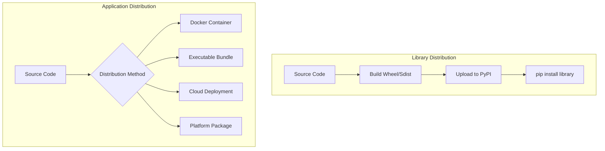
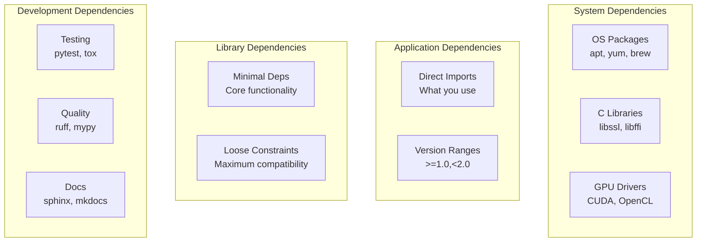
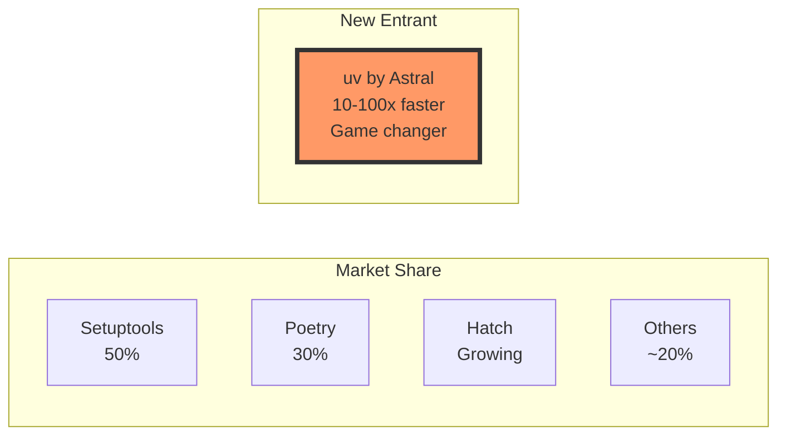
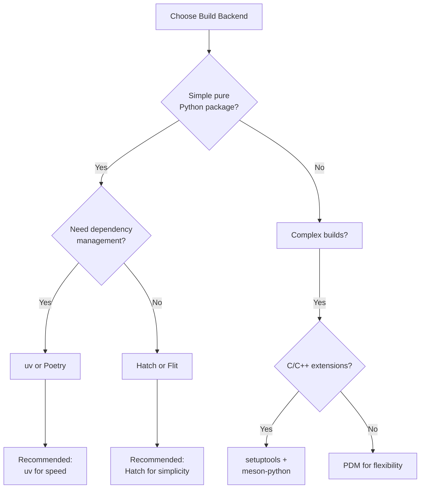
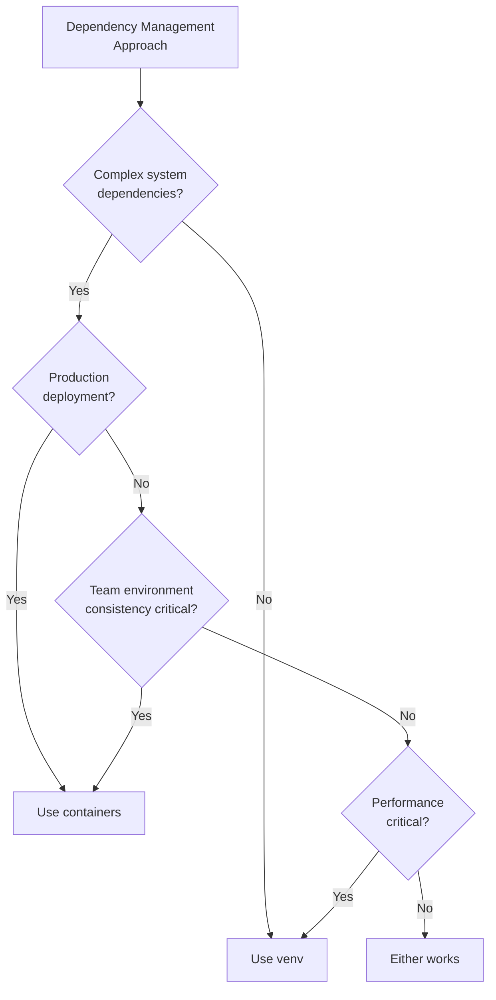
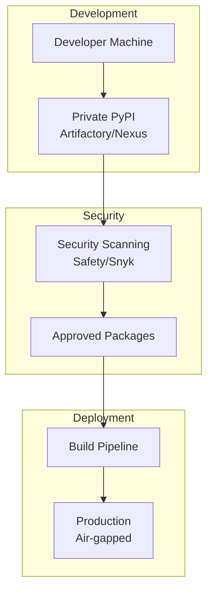
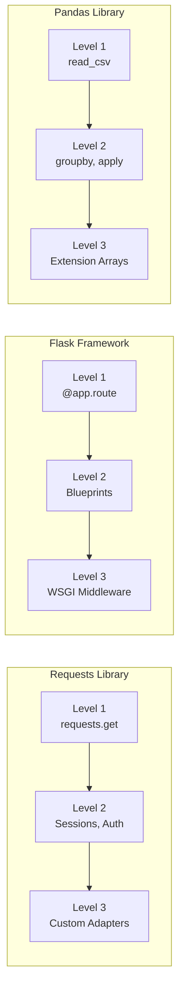

# Production Python: Packaging & Library Design Best Practices

## Introduction

This presentation covers modern Python packaging and library design for production environments, with a focus on the key differences between applications and libraries, dependency management layers, and avoiding common anti-patterns.

---

# Part 1: Applications vs Libraries - The Fundamental Divide

## Core Conceptual Differences

### Libraries
- **Building blocks** designed to be imported and reused
- Cannot control their environment - must coexist with other packages
- Primary purpose: provide reusable functionality to developers
- Examples: `requests`, `numpy`, `pandas`

### Applications  
- **Complete solutions** for end-user consumption
- Control their entire environment and dependency stack
- Often have CLIs, GUIs, or web interfaces
- Examples: Django projects, CLI tools, data pipelines

---

## Dependency Management: The Critical Difference

### Libraries: Be Permissive
```toml
# pyproject.toml for a library
dependencies = [
    "requests >= 2.25.0",  # Minimum version only
    "click >= 7.0",        # Avoid upper bounds
    "pydantic >= 1.8"      # Let consumers resolve
]
```

### Applications: Pin Everything
```txt
# requirements.txt for an application  
requests==2.28.1
click==8.1.3
pydantic==1.9.2
urllib3==1.26.12  # Even transitive deps
```

**Key Principle**: Libraries use loose constraints for compatibility; Applications pin versions for reproducibility

---

## Distribution and Packaging Strategies



---

# Part 2: The Twelve Factor App - Python Edition

## Which Factors Apply Where?

| Factor | Applications | Libraries |
|--------|--------------|-----------|
| 1. Codebase | ✅ Critical | ✅ Critical |
| 2. Dependencies | ✅ Pin versions | ⚠️ Loose constraints |
| 3. Config | ✅ Environment vars | ❌ Not applicable |
| 4. Backing Services | ✅ Critical | ❌ Not applicable |
| 5. Build/Release/Run | ✅ Essential | ⚠️ Build only |
| 6. Processes | ✅ Stateless | ❌ Not applicable |
| 7. Port Binding | ✅ Web apps | ❌ Not applicable |
| 8. Concurrency | ✅ Scale out | ⚠️ Thread-safety |
| 9. Disposability | ✅ Fast startup | ❌ Not applicable |
| 10. Dev/Prod Parity | ✅ Essential | ⚠️ Test envs |
| 11. Logs | ✅ Event streams | ⚠️ Optional |
| 12. Admin Processes | ✅ One-off tasks | ❌ Not applicable |

---

## Python-Specific 12-Factor Implementation

### Factor 3: Configuration in Environment Variables
```python
# Best practice: Type-safe config with Pydantic
from pydantic import BaseSettings

class Settings(BaseSettings):
    database_url: str
    secret_key: str
    debug: bool = False
    redis_url: str = "redis://localhost:6379"
    
    class Config:
        env_file = ".env"  # For local development

settings = Settings()
```

### Factor 5: Strict Build/Release/Run Separation
```dockerfile
# Multi-stage Dockerfile
FROM python:3.11-slim as builder
COPY requirements.txt .
RUN pip wheel --wheel-dir /wheels -r requirements.txt

FROM python:3.11-slim
COPY --from=builder /wheels /wheels
RUN pip install --no-cache /wheels/*
```

---

# Part 3: Dependency Management Layers

## The Four Layers of Dependencies



---

## Modern Dependency Declaration

```toml
# pyproject.toml - The modern standard
[project]
name = "myproject"
dependencies = [
    "requests>=2.28.0,<3.0.0",
    "click>=8.0",
    "pydantic~=2.0",  # Compatible release
]

[project.optional-dependencies]
test = [
    "pytest>=7.0",
    "pytest-cov>=4.0",
]
lint = [
    "ruff>=0.1.0",
    "mypy>=1.5.0",
]
dev = ["myproject[test,lint]"]  # Convenience group
```

---

# Part 4: Creating Reusable Python Packages

## The Anatomy of a Modern Python Package

```
mylib/
├── pyproject.toml          # Modern config (PEP 621)
├── README.md              
├── LICENSE                
├── src/                    # Src layout prevents import issues
│   └── mylib/
│       ├── __init__.py     # Package initialization
│       ├── core.py         # Main functionality
│       └── utils/
│           ├── __init__.py
│           └── helpers.py
├── tests/                  # Mirror package structure
│   ├── test_core.py
│   └── test_utils/
└── docs/
```

**Key Insight**: Use src layout to ensure you test the installed package, not the local directory

---

## Making Your Code Importable

### Anti-Pattern: Just Scripts
```python
# ❌ script.py - Not reusable
import requests

def get_data():
    return requests.get("https://api.example.com").json()

if __name__ == "__main__":
    data = get_data()
    print(data)
```

### Best Practice: Proper Package Structure
```python
# ✅ src/mypackage/__init__.py
from .api import get_data
__version__ = "1.0.0"

# ✅ src/mypackage/cli.py
def main():
    """Console script entry point."""
    data = get_data()
    print(data)

# ✅ pyproject.toml
[project.scripts]
mycommand = "mypackage.cli:main"
```

---

# Part 5: Production Python Tooling Evolution

## The 2024-2025 Tooling Revolution

### Old Stack (Multiple Tools)
- **Black** (formatting) 
- **Flake8** (linting)
- **isort** (import sorting)
- **pyupgrade** (syntax modernization)
- **autoflake** (unused code removal)

### New Stack (Unified Tools)
- **Ruff** (all-in-one linter/formatter)
  - 10-100x faster (Rust-based)
  - Replaces 5+ tools
  - CPython: 0.29s vs 60+ seconds

```bash
# One tool to rule them all
ruff check --fix .  # Lint and auto-fix
ruff format .       # Format code
```

---

## Type Checking with mypy

### Why Type Checking Matters in Production
- Catches errors before runtime
- Improves IDE support and refactoring
- Documents code behavior
- 67% of Python developers now use type checking

### Progressive Typing Strategy
```python
# Level 1: Start with critical functions
def process_users(users: list[dict[str, str]]) -> str | None:
    if not users:
        return None
    return users[0]["name"]

# Level 2: Use TypedDict for structure
from typing import TypedDict

class User(TypedDict):
    name: str
    email: str
    age: int

# Level 3: Advanced patterns
from typing import Protocol

class Processor(Protocol):
    def process(self, data: str) -> dict: ...
```

---

## pytest: The Testing Standard

### Why pytest Dominates
- Minimal boilerplate
- Powerful fixtures
- Rich assertion introspection
- 1000+ plugins available

### Testing Patterns
```python
# Fixtures for reusable setup
@pytest.fixture
def client():
    return APIClient(test_mode=True)

# Parametrized tests for comprehensive coverage
@pytest.mark.parametrize("input,expected", [
    ("hello", 5),
    ("pytest", 6),
    ("", 0),
])
def test_string_length(input, expected):
    assert len(input) == expected

# Integration with coverage
# pytest --cov=src --cov-report=html
```

---

# Part 6: Build Backend Comparison

## The Current Landscape (2024-2025)



---

## Build Backend Feature Comparison

| Feature | setuptools | Poetry | Hatch | uv (Astral) |
|---------|------------|---------|--------|-------------|
| **Performance** | Baseline | Slow | Good | 10-100x faster |
| **Lock Files** | No (use pip-tools) | Yes (proprietary) | No | Yes (standard) |
| **Env Management** | No | Yes | Yes | Yes |
| **Standards** | Full | Partial→Full | Full | Full |
| **Monorepo** | Limited | Limited | Limited | Workspaces |
| **Learning Curve** | High | Low | Medium | Low |

### The uv Revolution
- Rust-based for extreme performance
- Drop-in pip replacement
- Built-in Python version management
- Unified tool for entire workflow

---

## Choosing the Right Build Backend



---

# Part 7: Python Version Management

## Tool Comparison

| Tool | Purpose | Best For |
|------|---------|----------|
| **pyenv** | Python-only version management | Pure Python development |
| **asdf** | Multi-language version manager | Polyglot teams |
| **System packages** | OS-provided Python | System scripts only |
| **conda/mamba** | Scientific stack management | Data science with C deps |
| **uv** | Integrated Python management | Modern unified workflow |

### Modern Recommendation
```bash
# uv now handles Python installation too!
uv python install 3.11
uv venv --python 3.11
uv pip install -r requirements.txt
```

---

# Part 8: Containers - When They're Overused

## Container Anti-Patterns

### ❌ Using Docker as a Virtual Environment
```dockerfile
# Anti-pattern: Containerizing simple scripts
FROM python:3.11
COPY script.py .
RUN pip install requests
CMD ["python", "script.py"]
```
**Problem**: Adds complexity without benefit

### ✅ When Containers Make Sense
- Production deployment with complex dependencies
- Microservices architecture
- CI/CD pipeline consistency
- System-level dependency conflicts

### ✅ When Virtual Environments Suffice
- Local development
- Simple applications
- Pure Python dependencies
- Fast iteration needed

---

## Container vs Virtual Environment Decision Matrix



---

# Part 9: Why Conda Might Not Be Production-Ready

## Conda Production Challenges

### Performance Issues
- Complex SAT solver = slow resolution
- Large disk footprint
- Environment solving gets harder over time

### Licensing Concerns (2024)
- Organizations with 200+ employees need commercial licenses
- Applies to default Anaconda channel
- Conda-forge remains free but limited

### Integration Problems
- Package versions lag behind PyPI
- Mixing pip and conda causes conflicts
- Corporate toolchains optimized for pip

### When Conda IS Appropriate
- Heavy scientific computing (NumPy, SciPy, CUDA)
- Multi-language environments (Python + R)
- Individual developers (<200 employees)
- Academic/educational use

---

# Part 10: On-Premises Python Best Practices

## Enterprise Python Architecture



### Key Components
- **Private PyPI**: JFrog Artifactory or Sonatype Nexus
- **Security Scanning**: Safety CLI, Snyk, Trivy
- **Reproducible Builds**: Lock files with hashes
- **Air-gap Strategy**: Vendored wheels for offline deployment

---

# Part 11: Library Design - The Scala Level Concept

## Progressive API Design Inspired by Scala Levels

### Level 1: Beginner-Friendly (80% of users)
```python
import mylib
result = mylib.process(data)  # Just works!
```

### Level 2: Power User (15% of users)
```python
client = mylib.Client(timeout=30, retries=5)
result = client.process(data, validate=True)
```

### Level 3: Expert/Extension (5% of users)
```python
class CustomProcessor(mylib.BaseProcessor):
    def process(self, data):
        # Custom implementation
        return super().process(transform(data))

client = mylib.Client(processor=CustomProcessor())
```

---

## Progressive Disclosure in Practice

### Real-World Examples



### Success Metrics
- New users productive in < 5 minutes
- 90% of problems solvable without advanced docs
- Experts can extend for any use case

---

# Summary: Production Python Best Practices

## Key Takeaways

### 1. **Applications vs Libraries**
- Libraries: Permissive dependencies, maximize compatibility
- Applications: Pin everything, control the environment

### 2. **Modern Tooling Stack (2024-2025)**
- **Linting/Formatting**: Ruff (replaces 5+ tools)
- **Type Checking**: mypy (still separate)
- **Testing**: pytest with fixtures
- **Build Backend**: uv for speed, Poetry for features
- **Version Management**: uv or pyenv

### 3. **Dependency Management**
- Use pyproject.toml (PEP 621)
- Separate dev dependencies
- Lock files for applications

---

## Key Takeaways (continued)

### 4. **Avoid Container Overuse**
- Containers for production deployment
- Virtual environments for development
- Don't use Docker as a fancy virtualenv

### 5. **Production Considerations**
- Private PyPI for enterprises
- Security scanning in CI/CD
- Air-gap deployment strategies

### 6. **Progressive API Design**
- Start simple for beginners
- Progressive disclosure of complexity
- Expert extensibility without compromising simplicity

---

## Action Items for Your Team

### Immediate (This Sprint)
1. Try Ruff on a small project - see the speed difference
2. Add type hints to one critical module
3. Set up pre-commit hooks for consistency

### Short Term (Next Quarter)
1. Migrate from Flake8/Black to Ruff
2. Implement private PyPI if needed
3. Create library design guidelines

### Long Term (This Year)
1. Evaluate uv for build performance gains
2. Establish dependency governance
3. Build progressive APIs for internal libraries

---

# Questions?

## Resources

### Tools Mentioned
- **Ruff**: https://github.com/astral-sh/ruff
- **uv**: https://github.com/astral-sh/uv
- **mypy**: https://mypy-lang.org/
- **Poetry**: https://python-poetry.org/
- **pytest**: https://pytest.org/

### Further Reading
- Python Packaging Authority: https://www.pypa.io/
- Twelve Factor App: https://12factor.net/
- Packaging Python Projects: https://packaging.python.org/

### Contact
[Your contact information here]

---

# Appendix: Quick Reference

## Dependency Declaration Cheat Sheet

```toml
# Library (permissive)
dependencies = [
    "requests >= 2.25.0",
    "click >= 7.0",
]

# Application (pinned)
dependencies = [
    "requests == 2.31.0",
    "click == 8.1.7",
]

# Development deps
[project.optional-dependencies]
dev = ["pytest", "ruff", "mypy"]
test = ["pytest", "pytest-cov"]
```

## Modern Python Project Template
```bash
cookiecutter gh:astral-sh/uv-cookiecutter
# or
hatch new myproject
```