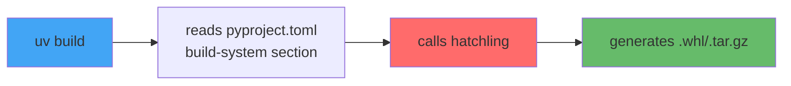

# Section 05: Library Repository Structure & Design

> How modern Python libraries organize code and define metadata for maximum reusability

## What Makes a Good Python Library

Successful libraries share four key traits:

### 🌐 **Maximum Compatibility**
- **Flexible dependencies**: `>=1.0,<2.0` not `==1.5.3`
- **Multi-Python support**: 3.8-3.12+
- **Cross-platform**: Windows/macOS/Linux

### 🔧 **Easy Integration**
- **Simple install**: `pip install your-library`
- **Pythonic API**: `library.process(data)`
- **Stable interfaces**: Semantic versioning

### 📦 **Professional Quality**
- **Robust testing**: Matrix testing across environments
- **Rich metadata**: Clear PyPI descriptions
- **Active maintenance**: Regular updates

### 🚀 **Performance Focus**
- **Minimal overhead**: Fast imports, lazy loading
- **Optional features**: `pip install lib[extras]`
- **Memory efficient**: No leaks or bloat

**Key Insight**: Libraries succeed by being **helpful but unobtrusive**.

## Library Development & Distribution Flow

Libraries follow a unique development pattern focused on **reusability** and **easy installation**:

```mermaid
graph TD
    A[📝 Write Library Code] --> B[🔧 Build Package]
    B --> C[✅ Test Compatibility]
    C --> D[📦 Distribute to PyPI]
    D --> E[🌍 Users Install Easily]

    A --> A1["src/ layout<br/>Flexible dependencies<br/>Multi-Python support"]
    B --> B1["Source dist + Wheel<br/>Rich metadata<br/>Built packages"]
    C --> C1["Matrix testing<br/>Multiple environments<br/>Version compatibility"]
    D --> D1["Public registry<br/>Semantic versioning<br/>Clear documentation"]
    E --> E1["pip install library<br/>Cross-platform<br/>Dependency resolution"]

    style A fill:#e3f2fd
    style B fill:#f3e5f5
    style C fill:#e8f5e8
    style D fill:#fff3e0
    style E fill:#fce4ec
```



**Key Flow Characteristics**:
- **Build once, install everywhere**: Single package works across platforms
- **Version compatibility**: Users can upgrade independently
- **Dependency resolution**: Package managers handle conflicts
- **Easy discovery**: Public registry with rich metadata

## High-Level Library Project Structure

Before diving into details, here's the bird's eye view of how libraries are organized:

```
my-awesome-library/                    # Repository root (kebab-case)
├── pyproject.toml                     # Modern Python project configuration
├── README.md                          # First impression for users
├── LICENSE                            # Legal usage terms
├── src/                               # Source code directory
│   └── my_awesome_library/            # Python package (snake_case, import my_awesome_library)
│       ├── __init__.py                # Package entry point
│       ├── core.py                    # Main functionality
│       └── utils.py                   # Helper functions
├── tests/                             # Test suite (mirrors src structure)
│   ├── __init__.py                    # Test package
│   ├── test_core.py                   # Tests for core.py
│   └── test_utils.py                  # Tests for utils.py
├── docs/                              # Documentation (built with Sphinx/MkDocs)
│   ├── index.md                       # Documentation home
│   └── api.md                         # API reference
└── .github/workflows/                 # CI/CD automation
```

### Key Components and Design

**🎯 src/ Layout** (Modern Best Practice):
- **Prevents accidental imports**: Avoids adding library folder to sys.path during development
- **Standard since 2020+**: Most new libraries use this pattern

**📋 pyproject.toml** (Replaces setup.py):
- **Modern standard**: Completely replaces legacy setup.py
- **Universal tool support**: uv, hatch, pip, black, ruff, pytest all use this file
- **Single configuration center**: One file for all project settings

**🔤 Naming Convention**:
- **Repository**: `my-awesome-library` (kebab-case for URLs/Git)
- **Package**: `my_awesome_library` (snake_case for Python imports)
- **Same name**: Only case format differs, content identical

**🧪 tests/ Structure**:
- **Mirror src/ layout**: `test_core.py` tests `core.py`, `test_utils.py` tests `utils.py`

**📚 docs/ Documentation**:
- **Built with tools**: Sphinx, MkDocs, or similar for web-based documentation
- **Auto-generated**: API docs from docstrings, manual guides

## pyproject.toml Fundamentals

The `pyproject.toml` file is the modern standard for Python project configuration. Before diving into configuration details, it's crucial to understand how different tools work together.

### Understanding Build Backends vs Project Management Tools

Python packaging involves two distinct tool types that often get confused:

**📦 Build Backends** - Generate installable packages:
- Transform source code into distributable packages (.whl, .tar.gz)
- Handle compilation, asset bundling, metadata generation
- **Examples**: `hatchling`, `setuptools`, `flit-core`, `poetry-core`

**🛠️ Project Management Tools** - Manage dependencies and workflow:
- Handle dependency resolution and virtual environments
- Coordinate development tasks and call build backends
- **Examples**: `uv`, `poetry`, `hatch`, `pdm`, `pip-tools`

### How They Work Together



**Key Point**: `uv` is **not** a build tool - it's an interface that calls the actual build backend!

### Tool Ecosystem Matrix

| Tool | Build Backend | Project Management | Key Strengths | Best For |
|------|---------------|-------------------|---------------|----------|
| **setuptools** | ✅ `setuptools>=61` | 🔧 Basic | Traditional, broad compatibility | Legacy projects, C extensions |
| **hatchling** | ✅ `hatchling` | ❌ | Modern, fast, simple | Most new libraries |
| **flit** | ✅ `flit_core` | 🔧 Basic | Minimalist, pure Python | Simple libraries |
| **uv** | ❌ | ✅ Full | Speed (10-100x), integrated Python | Fast development |
| **poetry** | ✅ `poetry-core` | ✅ Full | All-in-one solution | Complete ecosystem |
| **pdm** | ✅ `pdm-backend` | ✅ Full | Standards-compliant | Modern, PEP-focused |
| **hatch** | ✅ `hatchling` | ✅ Full | Rich features, build matrices | Complex workflows |

**💡 Modern Recommendations**:
- **Most libraries**: `uv` (project management) + `hatchling` (build backend)
- **Complex builds**: `hatch` (both project management and build backend)
- **Legacy/C extensions**: `uv` + `setuptools` (with careful migration planning)

### Configuration Sections

Different tools read different sections in pyproject.toml:

```toml
[build-system]
build-backend = "hatchling.build"  # Tells project managers which backend to call

[project]  # Standard metadata - all tools understand this
name = "my-library"
version = "0.1.0"

[tool.hatch.*]           # Hatchling's configuration
[tool.setuptools.*]      # Setuptools' configuration  
[tool.uv.*]              # uv's configuration (development only)
[tool.poetry.*]          # Poetry's configuration
```

**Important**: Each tool reads its own `[tool.toolname.*]` section. Project managers coordinate but don't interfere with build backend settings.

## pyproject.toml Configuration for Libraries

Here's how to design pyproject.toml specifically for libraries:

### Basic Structure

```toml
[project]
name = "my-awesome-library"
version = "0.1.0"
description = "A fantastic library that solves X problem"
readme = "README.md"
license = {text = "MIT"}
authors = [
    {name = "Your Name", email = "you@example.com"}
]
requires-python = ">=3.8"
classifiers = [
    "Development Status :: 4 - Beta",
    "Intended Audience :: Developers",
    "Programming Language :: Python :: 3.8",
    "Programming Language :: Python :: 3.9",
    "Programming Language :: Python :: 3.10",
    "Programming Language :: Python :: 3.11",
    "Programming Language :: Python :: 3.12",
]
dependencies = [
    "requests>=2.25.0,<3.0.0",
    "typer>=0.9.0,<1.0.0",
]

[project.optional-dependencies]
dev = [
    "pytest>=7.0.0",
    "black>=22.0.0",
    "ruff>=0.1.0",
]
docs = [
    "mkdocs>=1.4.0",
    "mkdocs-material>=8.0.0",
]

[project.urls]
Homepage = "https://github.com/username/my-awesome-library"
Documentation = "https://my-awesome-library.readthedocs.io"
Repository = "https://github.com/username/my-awesome-library.git"
Issues = "https://github.com/username/my-awesome-library/issues"

[build-system]
requires = ["hatchling"]
build-backend = "hatchling.build"

[tool.hatch.build.targets.wheel]
packages = ["src/my_awesome_library"]
```

### Library-Specific Dependency Strategy

**✅ Good: Flexible Version Ranges**
```toml
dependencies = [
    "requests>=2.25.0,<3.0.0",    # Allow patch and minor updates
    "typer>=0.9.0,<1.0.0",        # Compatible range
    "numpy>=1.20.0,<2.0.0",       # Avoid breaking changes
]
```

**❌ Bad: Overly Restrictive**
```toml
dependencies = [
    "requests==2.28.1",           # Too specific, causes conflicts
    "click>=8.1.7,<8.2.0",       # Unnecessary restrictions
]
```

**Why Flexible Ranges Matter**:
- **Compatibility**: Works with more user environments
- **Security**: Users can get security updates
- **Ecosystem health**: Reduces dependency conflicts
- **Future-proofing**: Compatible with newer versions

### Understanding optional-dependencies

```toml
[project.optional-dependencies]
# For end users who want extra features
plotting = ["matplotlib>=3.5.0", "seaborn>=0.11.0"]
async = ["aiohttp>=3.8.0", "asyncio-mqtt>=0.11.0"]

# For developers working on the library
dev = ["pytest>=7.0.0", "black>=22.0.0", "ruff>=0.1.0"]
test = ["pytest>=7.0.0", "coverage>=6.0.0", "pytest-cov>=4.0.0"]
docs = ["mkdocs>=1.4.0", "mkdocs-material>=8.0.0"]
```

**Installation Examples**:
```bash
# Basic installation
pip install my-awesome-library

# With plotting features
pip install my-awesome-library[plotting]

# With all optional features
pip install my-awesome-library[plotting,async]

# Development installation
pip install my-awesome-library[dev,test,docs]
```

### Understanding optional-dependencies vs dependency-groups

Two standards exist for organizing extra dependencies - this shows how Python packaging evolves:

**📊 Standard Comparison**:

| Aspect | **optional-dependencies** (PEP 621) | **dependency-groups** (PEP 735) |
|--------|-------------------------------------|----------------------------------|
| **Purpose** | End-user features | Development workflows |
| **Installation** | `pip install lib[feature]` | `uv sync --group test` |
| **Status** | ✅ Stable (2021) | 🚧 New (2024) |

**🔧 Tool Support Matrix**:

| Tool | optional-dependencies | dependency-groups | Notes |
|------|----------------------|-------------------|-------|
| **uv** | ✅ Full support | ✅ Full support | Leading implementation |
| **pip** | ✅ Full support | ❌ No support | Standard installer |
| **Poetry** | ✅ Full support | ❌ No support | Uses own format |
| **Hatch** | ✅ Full support | ⚠️ Partial | In development |
| **PDM** | ✅ Full support | ✅ Full support | Early adopter |

**💡 Best Practice**:
- **Use optional-dependencies** for user-facing features (`pip install lib[plotting]`)
- **Use dependency-groups** for development tools when supported (`uv sync --group test`)
- **Check tool compatibility** before choosing - not all tools support latest PEPs

**Example Configuration**:
```toml
[project.optional-dependencies]
# For end users - widely supported
plotting = ["matplotlib>=3.5.0", "seaborn>=0.11.0"] 

[dependency-groups]
# For developers - newer standard, check tool support
test = ["pytest>=7.0.0", "coverage>=6.0.0"]
docs = ["sphinx>=4.0.0", "furo>=2022.0.0"]
```

**📚 Learn More**: [PEP 735 Dependency Groups](https://packaging.python.org/en/latest/specifications/dependency-groups/)

## Tool Selection: uv for Libraries

### Why uv for Library Development

**🚀 Performance Benefits**:
- **10-100x faster** than pip for dependency resolution
- **Integrated Python management**: No need for separate pyenv
- **Built-in virtual environments**: Automatic .venv creation

**🔧 Library-Friendly Features**:
- **Multi-Python testing**: Easy testing across Python versions
- **Flexible dependency handling**: Respects version ranges properly
- **Modern standards**: Native pyproject.toml support

### Essential uv Commands for Libraries

```bash
# Initialize new library project
uv init --lib my-awesome-library
cd my-awesome-library

# Add dependencies to pyproject.toml
uv add "requests>=2.25.0,<3.0.0"
uv add "typer>=0.9.0,<1.0.0"

# Add development dependencies
uv add --dev pytest black ruff

# Install in development mode
uv sync

# Test your library as end users would install it
uv build
uv run --isolated python -c "import my_awesome_library; print('Success!')"

# Test with different Python versions
uv run --python 3.8 pytest
uv run --python 3.11 pytest
```

### Development Workflow

```bash
# Daily development cycle
uv sync                    # Ensure environment is up to date
uv run pytest            # Run tests
uv run black src/         # Format code
uv run ruff check src/    # Lint code

# Before releasing
uv build                  # Build distribution packages
uv run twine check dist/* # Verify packages are valid
```

## Distribution and Publishing

### Build and Release Workflow

```bash
# 1. Prepare release
# Update version in pyproject.toml
# Update CHANGELOG.md
# Commit changes

# 2. Build distribution packages
uv build

# 3. Verify packages
uv run twine check dist/*

# 4. Upload to PyPI
uv run twine upload dist/*

# 5. Tag release
git tag v0.1.0
git push origin v0.1.0
```

### What Gets Distributed

**📦 Built Packages**:
- **Source distribution (.tar.gz)**: Contains source code, users compile if needed
- **Wheel (.whl)**: Pre-compiled package, faster installation

**📋 Package Contents**:
- Your Python package from `src/`
- README.md, LICENSE, and other specified files
- Metadata from pyproject.toml
- **NOT included**: tests/, docs/, .github/, development files

## Key Takeaways

1. **Good libraries prioritize compatibility** → flexible dependencies, wide Python support
2. **src/ layout provides testing isolation** → ensures package works when installed
3. **pyproject.toml is the modern standard** → replaces setup.py for configuration
4. **Flexible version ranges prevent conflicts** → `>=1.0,<2.0` instead of `==1.5.3`
5. **uv accelerates library development** → 10-100x faster than traditional tools
6. **Optional dependencies enable modularity** → users install only what they need
7. **Build verification catches packaging issues** → test installation before release

---

**Next Section**: [06-application-example-docker-uv.md](06-application-example-docker-uv.md) - Complete Docker + uv application example
**Previous Section**: [04-python-environment-tools.md](04-python-environment-tools.md) - Python environment tools