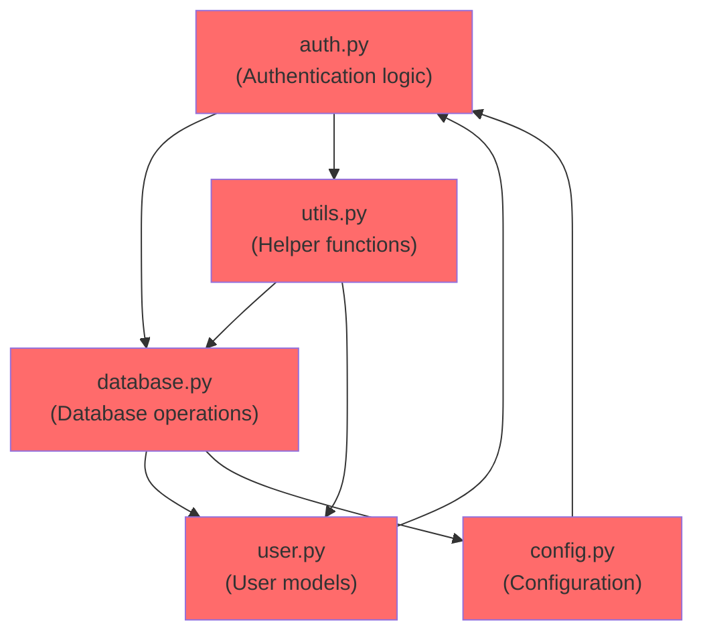
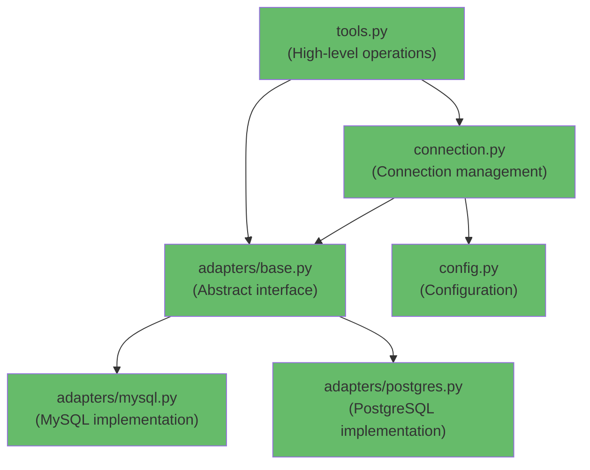

# Section 06: Module and Subpackage Design

> **Environment Control Focus**: How library code organization impacts downstream environments

## What Makes Good Module Design

Well-designed Python modules share four key characteristics:

### 🎯 **Single Responsibility**
- **One clear purpose**: Each module serves a specific function
- **Focused scope**: Related functionality grouped together
- **Easy to understand**: Module name reflects its purpose

### 🔌 **Clear Interface**
- **Explicit exports**: Use `__all__` to define public API
- **Stable public API**: Changes don't break downstream code  
- **Intuitive naming**: Functions and classes have obvious purposes

### 🔗 **Minimal Dependencies**
- **Avoid circular imports**: Modules don't import each other
- **Loose coupling**: Changes in one module don't cascade
- **Optional dependencies**: Graceful handling of missing packages

### 📁 **Logical Organization**
- **Shallow structure**: Maximum 3 levels of nesting
- **Meaningful hierarchy**: Directory structure reflects functionality
- **Consistent patterns**: Similar modules organized similarly

**Key Insight**: Good modules are **discoverable and maintainable**.

## Why You Need __init__.py

While Python 3.3+ doesn't technically require `__init__.py` files, **you should always use them** for proper package design.

### Real-World Example: API Control

**Without `__init__.py` - Users see messy internals:**
```python
# mypackage/database.py
class DatabaseConnection: pass
class _InternalCache: pass      # Private implementation detail
def connect(): pass
def _cleanup_connections(): pass # Private helper

# User imports (without __init__.py)
from mypackage.database import DatabaseConnection, _InternalCache  # Uh oh!
from mypackage.database import connect, _cleanup_connections       # Messy!
```

**With `__init__.py` - Clean, controlled API:**
```python
# mypackage/__init__.py
from .database import DatabaseConnection, connect
from .auth import authenticate, User
from .utils import format_data

__version__ = "1.2.0"
__all__ = ["DatabaseConnection", "connect", "authenticate", "User", "format_data"]

# User imports (with __init__.py)
from mypackage import DatabaseConnection, connect  # Clean!
# Can't accidentally import _InternalCache or _cleanup_connections
```

### Best Practice Recommendation

**Always use `__init__.py`** - it's essential for good package design:

**✅ Benefits of `__init__.py`:**
- **API control**: Define what users can import
- **Clean imports**: `from mypackage import function` instead of `from mypackage.module import function`
- **Better performance**: Faster imports and IDE support

### API Control with `__all__`

**`__all__` works in any module** - not just `__init__.py` files:

**❌ Without `__all__` - Everything is exposed:**
```python
# mypackage/__init__.py - DON'T DO THIS
from .auth import *      # Name conflicts!
from .database import *  # Which User class gets imported?

# mypackage/utils.py
_CACHE = {}  # Private global
TEMP_DIR = "/tmp"  # Module constant
def public_function(): pass
def _private_helper(): pass  # Convention: _ prefix

# User code - namespace pollution!
from mypackage.utils import *
print(_CACHE)  # Uh oh, accessing internals!
```

**✅ With `__all__` - Controlled API:**
```python
# mypackage/__init__.py - Explicit imports
from .database import DatabaseConnection, connect
from .auth import authenticate, User
from .utils import format_data

__all__ = ["DatabaseConnection", "connect", "authenticate", "User", "format_data"]

# mypackage/utils.py
__all__ = ["public_function", "TEMP_DIR"]  # Explicit exports only!
# Now 'from mypackage.utils import *' only imports these two items
```

The reality is: **Always use `__init__.py` with explicit imports and `__all__`**.

### Common Anti-Patterns to Avoid

#### 2. Deep Nesting Without Purpose

**❌ DON'T:**
```
mypackage/
├── core/
│   └── utils/
│       └── helpers/
│           └── functions/
│               └── basic.py  # 5 levels deep! What does this do?
```

**Problems with deep nesting:**
- **Painful imports**: `from mypackage.core.utils.helpers.functions.basic import function`
- **Unclear organization**: Generic names like "utils", "helpers" don't explain purpose
- **Maintenance overhead**: Moving files requires updating many import paths

**✅ DO:**
```
mypackage/
├── preprocessing/
│   ├── text.py      # Clear purpose: text preprocessing
│   └── numerical.py # Clear purpose: numerical preprocessing
└── models/
    └── base.py      # 2-3 levels max, obvious function

# Result: Simple imports
from mypackage.preprocessing import text
from mypackage.models import base
```

**Rule of thumb**: If you can't explain why a directory exists in one sentence, flatten the structure.

#### 3. Circular Dependencies and Spaghetti Imports

**❌ BAD: Tangled Dependencies**



**Problems:**
- **Circular imports**: auth.py ↔ user.py ↔ database.py creates import loops
- **High coupling**: Changing config.py breaks auth.py, which breaks user.py
- **Hard to test**: Can't test database.py without also loading auth and user modules

**✅ GOOD: Layered Dependencies**



**Benefits:**
- **Clear hierarchy**: Dependencies flow in one direction only
- **Loose coupling**: Each module has minimal dependencies
- **Easy testing**: Test from bottom (config) to top (tools)

**Why Clear Dependencies Make Testing Easier:**

```python
# Clear dependencies = easy to test
def process_data(data):
    # You know exactly what this function depends on
    result = validate_input(data)      # From mypackage.validation
    processed = transform_data(result) # From mypackage.transforms
    return save_result(processed)      # From mypackage.storage

# Easy to mock in tests:
@patch('mymodule.save_result')
@patch('mymodule.transform_data') 
@patch('mymodule.validate_input')
def test_process_data(mock_validate, mock_transform, mock_save):
    # Clear what needs mocking
```

**Key Principle**: **Modules should depend on as few other modules as possible. The fewer modules that depend on you, the safer your changes become.**

#### 4. Safe Optional Dependency Handling

This connects to **optional dependencies** covered in [Section 05](05-library-repository-structure.md#understanding-optional-dependencies) - when you define `[project.optional-dependencies]` in pyproject.toml, you need to handle them safely in your code.

**❌ DON'T:**
```python
# visualization.py (matplotlib is optional dependency from Section 05)
import matplotlib.pyplot as plt      # Crashes if user didn't install lib[plotting]!
plt.style.use('seaborn')              # Side effect during import!
```

**✅ DO: Basic Pattern**
```python
# visualization.py - Safe optional dependency handling
try:
    import matplotlib.pyplot as plt
    HAS_MATPLOTLIB = True
except ImportError:
    plt = None
    HAS_MATPLOTLIB = False

def create_plot():
    if not HAS_MATPLOTLIB:
        raise ImportError("matplotlib required for plotting. Install with: pip install matplotlib")
    # ... actual plotting code
```

**✅ DO: Feature Detection Pattern**
```python
# mypackage/features/__init__.py
def _check_package_available(package_name):
    """Check if a package is installed (not if it's imported)"""
    try:
        __import__(package_name)
        return True
    except ImportError:
        return False

# Feature detection based on package availability
FEATURES = {
    'plotting': _check_package_available('matplotlib'),
    'advanced_math': _check_package_available('numpy'),
}

# Conditional imports based on available features
if FEATURES['plotting']:
    from .plotting import create_plot
if FEATURES['advanced_math']:
    from .advanced import advanced_function
```


## Key Takeaways

1. **Good modules have single responsibility** → easier to understand, test, and maintain
2. **Always use `__init__.py` with `__all__`** → control your API and prevent namespace pollution
3. **Avoid deep nesting beyond 3 levels** → keeps imports simple and structure discoverable
4. **Design layered dependencies** → minimize coupling, prevent circular imports, and enable easy testing
5. **Handle optional dependencies safely** → try/except patterns let libraries work in minimal environments


---

**Next Section**: [08-python-packaging-before-modern-era.md](08-python-packaging-before-modern-era.md) - The Wild West years
**Previous Section**: [06-application-example-docker-uv.md](06-application-example-docker-uv.md) - Complete Docker + uv application example