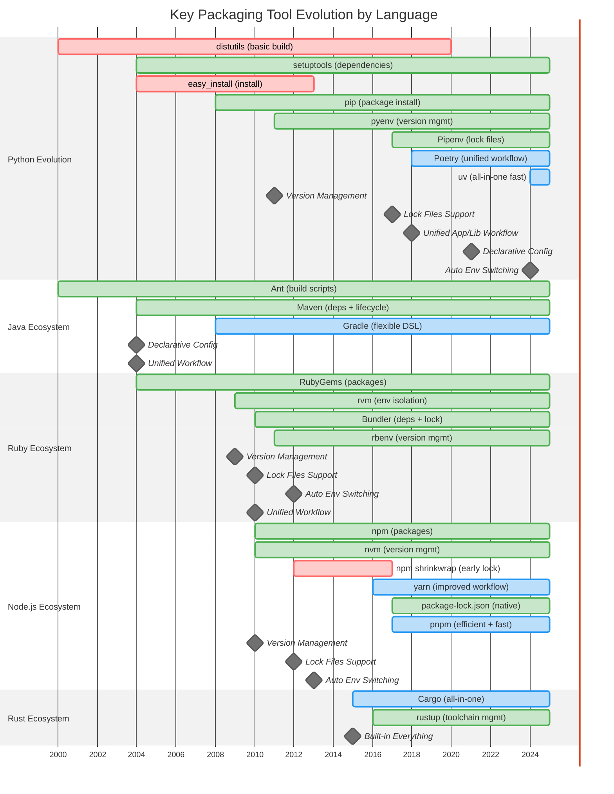

# Section 08: The Problems - Python's Packaging Pain Points (2000-2016)

> From packaging chaos to industry leadership through standardization

## What Made Python Packaging So Painful?

**The Five Core Problems** (ordered by impact on developer pain):

### 1. **🏚️ Environment Management Hell**
*The #1 daily pain point for every Python developer*
- **No auto version switching**: Unlike Ruby's `.ruby-version` (2009) or Node's `.nvmrc` (2013)
- **Manual activation nightmare**: `source venv/bin/activate` vs automatic project isolation
- **Python version chaos**: System Python? pyenv? conda? Docker? All conflicting
- **Impact**: Wasted hours on "works on my machine" problems

### 2. **🎯 No Unified Workflow**
*Different tools for different project types = confusion*
- **Libraries**: setup.py + twine + PyPI (complex but functional)
- **Applications**: requirements.txt + pip (primitive and error-prone)
- **Data Science**: conda + environment.yml (incompatible with PyPI)
- **Impact**: No single "right way" to package Python projects

### 3. **🔒 Lock Files = "pip freeze" Disaster**
*No real dependency resolution until 2017*
- **Mixed dependencies**: Direct and transitive deps jumbled together
- **No metadata**: Lost information about why packages were installed
- **No checksums**: Zero integrity verification for production
- **Impact**: Production deployments were gambling with dependencies

### 4. **📚 Community Fragmentation**
*No leadership, no standards, no consensus*
- **No official guide until 2013**: PyPUG came too late
- **Ad-hoc solutions everywhere**: Everyone invented their own homegrown approaches
- **Tutorial chaos**: Stack Overflow answers contradicted each other
- **Impact**: New developers had no trusted path to follow

### 5. **🔧 Executable setup.py**
*Security nightmare and tooling blocker*
- **Arbitrary code execution**: Installing packages could run anything
- **Dynamic metadata**: Tools couldn't analyze without executing
- **No caching possible**: Every operation required re-execution
- **Impact**: Slow, insecure, and incompatible with modern tooling

## Python's Transformation: From Worst to Best (2015-2025)

### Python's Development Timeline: Problem Periods and Solutions

**Tool Status Legend**:
- 🟩 **Green (Stable)**: Mature tools still in active use
- 🟦 **Blue (Active)**: Modern tools gaining adoption
- 🟥 **Red (Deprecated)**: Legacy tools no longer recommended
- ⚪ **Milestones**: Key feature breakthroughs in packaging evolution



### Multi-Language Ecosystem Comparison: Timeline Summary

| **Feature** | **Java** | **Ruby** | **Node.js** | **Rust** | **Go** | **Python Before** | **Python 2025** |
|------------|----------|----------|-------------|----------|---------|-------------------|-----------------|
| **🎯 Unified Workflow** | Maven<br/>(2004) | Bundler<br/>(2010) | npm<br/>(2010) | Cargo<br/>(2015) | go mod<br/>(2018) | ❌ Split tools<br/>(apps vs libs) | ✅ **uv**<br/>(2024) |
| **📌 Version Management** | JVM handles | rvm/rbenv<br/>(2009) | nvm<br/>(2010) | rustup<br/>(2016) | Built-in | ❌ Manual install | ✅ **uv python**<br/>(2024) |
| **🔒 Lock Files** | POM versions | Gemfile.lock<br/>(2010) | package-lock<br/>(2017) | Cargo.lock<br/>(2015) | go.sum<br/>(2018) | ❌ pip freeze mess | ✅ **PEP 751**<br/>(2025) |
| **🔄 Auto Env Switch** | Not needed | ✅ Since 2012 | .nvmrc<br/>(2013) | Built-in | Not needed | ❌ Manual activate | ✅ **uv auto**<br/>(2024) |
| **📝 Declarative Config** | pom.xml<br/>(2004) | Gemfile<br/>(2010) | package.json<br/>(2010) | Cargo.toml<br/>(2015) | go.mod<br/>(2018) | ❌ setup.py code | ✅ **pyproject.toml**<br/>(2021) |

**The Pattern**: Languages that succeeded had **unified tools from the start**. Python's 2025 transformation finally achieved this through uv + standardization.


## Why Was Python So Far Behind?

### **Internal Crisis: No Leadership or Standards**
- **Java**: Oracle/Sun drove Maven standards from the top down
- **Ruby**: Rails community created Bundler and established conventions
- **Node.js**: npm Inc. coordinated ecosystem development
- **Python**: No BDFL support for packaging, no corporate backing, "good enough" mentality dominated

### **Conflicting User Communities**
- **Web developers**: Wanted Ruby-like simplicity (pip + requirements.txt)
- **Data scientists**: Needed conda ecosystems (conda + environment.yml)
- **System admins**: Preferred OS packages (apt, yum packages)
- **Enterprise teams**: Demanded reproducible environments (Docker + exact versions)
- **Result**: Fragmented tools serving different needs instead of unified consensus

### **The "Scripting Mentality" Problem**
Early Python adoption came primarily from data science and research communities who:
- Lacked mature software engineering practices
- Focused on "getting scripts to work" rather than production systems
- Had no experience with better packaging systems for comparison
- Didn't pressure the community for better tools

This changed when experienced developers from other languages joined Python and brought knowledge of superior packaging approaches.

## The Turning Point: Why Change Finally Came

### **External Pressure**
- **Developers experienced better tooling**: Once you used cargo, npm, or bundler, Python felt primitive
- **Enterprise standards**: Production systems demanded reproducible builds and security compliance

### **Internal Crisis**
- **Python in production systems** required exact reproducibility and reliability
- **Software engineers adopting Python** brought higher expectations from other ecosystems
- **Community exhaustion**: Endless conflicting tutorials and outdated advice

## **Python's Current State (2025): From Chaos to Mature Tooling**

**Tool Maturity Revolution (2017-2025)**: The key transformation wasn't just standards—it was **tool usability** that changed everything.

**Before Mature Tools (2000-2017)**:
- **High barrier to entry**: Complex multi-step processes discouraged proper practices
- **"Ad-hoc solutions everywhere"**: Developers chose quick-and-dirty approaches over proper environment management
- **Knowledge gap**: Only experts could set up reproducible environments
- **Result**: "Scripts mentality" instead of production engineering practices

**Tool Maturity Breakthrough**:
- **Poetry (2018)**: First truly user-friendly unified workflow - single command project setup
- **Pipenv (2017)**: Made virtual environments automatic and invisible to users
- **uv (2024)**: 10-100x speed improvement made proper practices actually faster than shortcuts

**Why Tool Maturity Matters More Than Standards**:

1. **🚀 Lower Barriers**: Easy tools make good practices the default choice, not the expert choice
2. **⚡ Speed Incentives**: When `uv sync` is faster than manual pip installs, developers naturally adopt best practices
3. **🔄 Workflow Integration**: Mature tools handle complexity automatically—no more "土炮" workarounds
4. **📚 Knowledge Transfer**: Intuitive interfaces mean junior developers can follow senior practices immediately

**The Standardization Paradox: Why Good Tools Didn't Change Python Culture**

Python's delayed standardization created a critical problem: **non-standard tools couldn't achieve universal adoption**.

**Python's Non-Standard Tool Problem**:
- **Pipenv (2017)** and **Poetry (2018)** solved real problems but remained niche
- **Low community adoption**: Even excellent tools stayed "expert recommendations"
- **Fragmentation continued**: Teams stuck with familiar pip + requirements.txt
- **No universal workflow**: Different projects used different approaches

**Why Non-Standard Tools Failed to Scale**:
- **Installation friction**: Separate tool installation beyond standard Python
- **Corporate resistance**: Non-standard tools face approval barriers
- **Framework documentation inertia**: Django, Flask still show requirements.txt examples in 2025
- **Tutorial gap**: Most Python tutorials still taught old methods
- **Migration costs**: Existing projects stayed with working (but inferior) approaches

**The Framework Problem: Django vs Rails Leadership**

| Framework | Dependency Example | Impact on Community |
|-----------|-------------------|-------------------|
| **Rails** | Always showed Bundler + Gemfile | ✅ **Led by example** - established best practices |
| **Django** | Still shows requirements.txt | ❌ **Perpetuates old habits** - new developers copy outdated patterns |
| **FastAPI** | Shows multiple options | 🟡 **Progress but confusing** - choice paralysis |

**The Missing Leadership**: Unlike Rails which **immediately demonstrated production best practices**, Python frameworks maintained "backward compatibility" with inferior approaches, slowing ecosystem-wide adoption of better tools.

### Framework Philosophy: The Root Cause of Python's Delays

**Rails "Omakase" vs Django "Batteries Included, Tools Optional"**

```
Rails Philosophy (2005):
"I'll pick the tools for you. Trust me, this is the best way."
— DHH, Convention over Configuration

Django Philosophy (2005):
"Here's a great framework. Pick whatever tools you like."
— "We're all consenting adults here"
```

| Aspect | Rails/Ruby | Python/Django | Impact |
|--------|------------|---------------|---------|
| **Official Stance** | Strong opinions, clear guidance | Neutral, avoids forcing tools | Rails drives adoption |
| **Tool Integration** | Framework deeply integrates tools | Framework and tools separate | Ruby tools become standard |
| **Update Philosophy** | Rapid adoption of new practices | Conservative, preserves compatibility | Python lags behind |
| **Target Users** | Web developers seeking productivity | Broader audience, flexible needs | Different adoption patterns |

**Why This Philosophy Difference Mattered**:

- **Rails (2010)**: "First step is `bundle install`. No other choice!" → Universal Bundler adoption
- **Django (2025)**: "Use pip install. Maybe try Poetry if you want." → Fragmented practices continue
- **Node.js**: Learned from Rails, npm was standard from day 1 (2010)

**The Cultural Impact**: Rails created **forced consensus** through framework leadership. Python's "freedom of choice" created **analysis paralysis** and delayed ecosystem evolution by 10+ years.

**Other Languages: Standard Tools = Universal Adoption**:
- **Java Maven**: Built into standard ecosystem → universal adoption
- **Ruby Bundler**: Community-standard tool → became the default
- **Node.js npm**: Shipped with Node → everyone uses it immediately
- **Rust Cargo**: Language-integrated → no choice but to use properly

**Python's 2025 Transformation - From Expert-Only to Universal**:

- **2015**: Only packaging experts used proper environments and lock files
- **2018**: Poetry made unified workflows accessible to regular developers
- **2021**: PEP 621/735/751 provided standardization foundation
- **2024**: uv combined speed + standards compatibility → universal adoption finally possible
- **Result**: Proper packaging became mainstream, not just expert recommendation

**The Breakthrough**: Python's transformation required **both** mature tools AND standardization. uv succeeded where Poetry/Pipenv couldn't because it builds on standard foundations while delivering unprecedented speed and integration.

**The Result**: Python transformed from **expert-only complexity** (2015) to **universally accessible, standards-based tooling** (2025)!

## Real-World Pain Points: How Python's Gaps Hurt Teams

### 🚨 Production Deployment Failures

**Large-scale dependency conflicts (pre-2017)**:
- Team deploys web application that works locally
- Production fails with `ImportError: cannot import name 'JSONField'`
- Cause: Different Django versions between local `pip freeze` and production
- **24-hour outage** while team manually reconstructs exact environment

**Cross-team collaboration nightmare**:
- Data scientist shares ML model with backend team
- "Works on my machine" but fails in production pipeline
- Cause: Conda vs pip package conflicts, no lock files
- **3-week delay** to rebuild model with compatible dependencies

### 💔 Developer Experience Horror Stories

**Java developer joins Python team (2016)**:
> "In Java, I run `mvn install` and everything works. In Python, I need 6 different tools, 3 virtual environments, and a PhD in package management just to run the application."

**Node.js developer switching to Python data science**:
> "npm has had `package-lock.json` since 2017. Why am I manually managing `requirements.txt` files in 2020? This feels like going back 10 years."

### 🔥 Enterprise Integration Failures

**Security compliance blocked**:
- Enterprise security requires reproducible builds with checksums
- Python's `pip freeze` provides no integrity verification
- **6-month project delay** waiting for Poetry adoption and lock file implementation

## Technical Examples: Core Problems in Detail

### 1. 🔧 Setup.py: Security and Tooling Problems

**The Problem**: setup.py was executable code, not data
- Security risk: arbitrary code execution during install
- Tooling blocker: IDEs couldn't parse package metadata
- Dependency analysis required code execution

**Other languages used declarative formats**:
- **Java (2004)**: XML configuration
- **Node.js (2010)**: JSON metadata
- **Ruby (2010)**: Restricted DSL

### Environment Management: Python vs Others

<table>
<tr><th>Language</th><th>Commands</th><th>Experience</th></tr>
<tr>
<td><b>Python 2012</b></td>
<td>

```bash
# Manual hell
sudo apt-get install python3.6
virtualenv venv
source venv/bin/activate
pip install -r requirements.txt
```

</td>
<td>🔴 4 manual steps</td>
</tr>
<tr>
<td><b>Ruby 2012</b></td>
<td>

```bash
# Auto everything
cd project/  # reads .ruby-version
bundle install
```

</td>
<td>🟢 Automatic</td>
</tr>
<tr>
<td><b>Node 2013</b></td>
<td>

```bash
# Project isolated
nvm use  # reads .nvmrc
npm install
```

</td>
<td>🟢 Project files</td>
</tr>
</table>

### 3. 🎭 Fragmented Dependency Management: Applications vs Libraries

**The Real Problem**: Two completely different workflows for the same language

*Applications - Manual requirements.txt hell:*
```txt
# requirements.txt - Too primitive, hard to manage
django==3.2
requests==2.25

# requirements-dev.txt - Manual file splitting
pytest==6.0
black==21.0
-r requirements.txt  # Manual inclusion, error-prone
```

*Libraries - extras_require worked but isolated:*
```python
setup(
    name='mylib',
    install_requires=['requests>=2.0'],
    extras_require={
        'dev': ['pytest>=6.0', 'black>=21.0'],  # ✅ This actually worked well
        'docs': ['sphinx>=3.0'],
    }
)
```

**The Problems**:
- ✅ **extras_require was well-designed** and fully functional
- ❌ **Applications**: requirements.txt was too manual, primitive, error-prone
- ❌ **No unified tooling**: Different workflows for applications vs libraries
- ❌ **Tools couldn't bridge**: Applications couldn't easily use library-style dependency groups

**Other languages had unified approaches**:
- **Java (2004)**: Maven scopes work for all project types
- **Node.js (2010)**: `devDependencies` work for all project types
- **Ruby (2010)**: Gemfile groups work for all project types

### 5. 💥 Lock File Evolution: From pip freeze to Standards

**Python's pip freeze problems**:
```txt
# requirements.txt - everything mixed together
Django==4.1.0       # Direct? Transitive?
certifi==2022.6.15  # From where?
sqlparse==0.4.2     # Django dependency?
```

**Modern lock file pattern** (Ruby 2010, Node.js 2017, Python 2025):
- **Separate direct vs transitive dependencies**
- **Reproducible metadata** (checksums, URLs)
- **Clear dependency trees** showing relationships
- **Automatic generation** from declarative config

**Python's breakthrough**: Pipenv (2017) → Poetry (2018) → PEP 751 (2025)


## Key Takeaways and Future Outlook

### **Python's Community Evolution Saved the Ecosystem**

**Early Python Community (2000-2015)**:
- **Primary users**: Data scientists and ML researchers
- **Limited production experience**: Focused on "getting scripts to work"
- **No comparison baseline**: Hadn't experienced better packaging systems
- **Result**: Accepted suboptimal tooling as "normal"

**Community Transformation (2015-2025)**:
- **Experienced developers joined**: Brought knowledge from Java, Ruby, Node.js ecosystems
- **Higher expectations**: Demanded production-grade tooling and practices
- **External pressure**: "This feels primitive compared to Maven/Bundler/npm"
- **Result**: Community finally prioritized proper packaging solutions

### **Python's Unique System Package Challenge**

Python faces a unique challenge that other languages largely avoid:

**Clean separation in other languages:**
- **Pure scripting** (Node.js, Ruby): Minimal system dependencies
- **Compiled** (C/C++, Rust, Go): System integration expected and well-handled
- **VM-based** (Java): JVM provides consistent abstraction

**Python's hybrid complexity:**
- **Most code**: Pure Python, no system dependencies needed
- **ML libraries**: Heavy system packages + GPU drivers + hardware optimization
- **Result**: Dual nature makes packaging significantly more complex

### **Ongoing Challenges and Limitations**

**Remaining unsolved problems:**

- **🔧 System Package Dependencies**: conda vs PyPI divide continues ecosystem fragmentation
- **🖥️ Hardware Binding**: GPU drivers + system packages + Python libraries = complex dependencies
- **🎯 No Universal Solution**: Unlike other languages, Python lacks one-size-fits-all packaging approach

### **Lessons for Python Developers**

**Cross-language learning benefits:**
- **🌍 Broaden perspective**: Other languages solved packaging problems years earlier
- **🔍 Recognize limitations**: Better tools exist - demand improvements
- **⚡ Accelerate growth**: Cross-language knowledge speeds individual and ecosystem evolution
- **🎯 Better advocacy**: Understanding superior approaches helps drive Python improvements

---

**Next Section**: [09-the-root-causes-why-python-fell-behind.md](09-the-root-causes-why-python-fell-behind.md) - The Root Causes: Why Python fell behind & how it caught up
**Previous Section**: [07-module-subpackage-design.md](07-module-subpackage-design.md) - Module & subpackage design