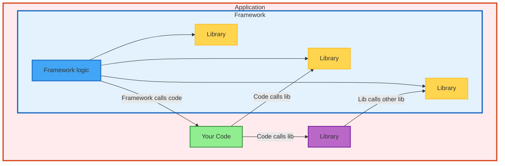

# Application vs Framework vs Library: Understanding the Fundamental Differences



| Type | Who Controls | Environment Needs | Python Examples | Java Examples |
|------|--------------|-------------------|-----------------|---------------|
| **Library** | **You** control when/how call it| Broad compatibility | `pandas`, `requests` | `Guava`, `Jackson` |
| **Framework** | **It** calls your code | Plugin ecosystem | `Django`, `Flask` | `Spring`, `Hibernate` |
| **Application** | **Self-contained** | Varies by distribution | `jupyter`, `black` | `Maven`, `IntelliJ` |
| **Hybrid** | **Dual interface** | Both broad & targeted | `pytest`, `pip` | `Tomcat`, `Gradle` |


## Code Examples: How Each Type Works

```python
# LIBRARY: You control when to call
import requests
response = requests.get(url)  # YOU decide when

# FRAMEWORK: It calls your code
@app.route('/users/<id>')
def get_user(id):  # Flask calls this when route matches
    return {"name": "John"}

# APPLICATION: Standalone execution
if __name__ == "__main__":
    app.run()  # Runs independently
```

## Environment Control & Dependency Strategy

| Type | Environment Control | How they depend on `requests` | Impact of Wrong Choice |
|------|-------------------|------------------|-------------------|
| **Library** | ❌ **Minimal Control** - Shared environments | `requests>=2.20,<3.0` | Too strict → breaks other libraries |
| **Framework** | 🔸 **Partial Control** - Manages plugin ecosystem | `requests>=2.25,<3.0` | Too strict → users can't build their apps upon |
| **Application (Public)** | 🔸 **Partial Control** - Must work in user environments | `requests>=2.20,<3.0` | Too strict → users can't install |
| **Application (Private)** | ✅ **Full Control** - Own environments | `requests==2.28.1` | Too loose → deployment inconsistency |

**Key Insight**: Environment control level determines dependency flexibility needs, but **distribution model** can override this for applications.


## Key Takeaway

**The fundamental distinction: Who calls whom?**
- **Libraries**: You call them → Simple, focused functionality
- **Frameworks**: They call you → Control flow inversion, manage complexity
- **Applications**: Self-contained → Handle complete workflows

**Dependency management is about balancing compatibility vs stability:**
- More flexibility → Better compatibility, less stability
- More constraints → Better stability, worse compatibility
- **Exception**: Simple tools with excellent test coverage can achieve both

**Complexity drives environment control needs:**
- **Libraries**: Usually simple → Can maintain both compatibility and stability
- **Applications**: More complex → Need higher environment control to ensure reliability