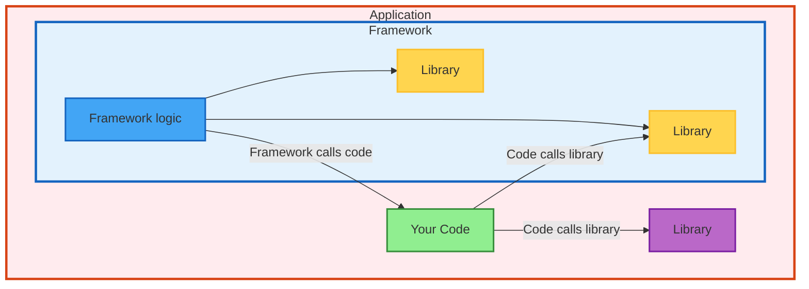

# Application vs Framework vs Library: Understanding the Fundamental Differences



| Type | Who Controls | Environment Needs | Example |
|------|--------------|-------------------|---------|
| **Library** | **You** control when/how | Broad compatibility | `pandas`, `requests` |
| **Framework** | **It** calls your code | Plugin ecosystem | `Django`, `Flask` |
| **Application** | **Self-contained** | Target-specific | `jupyter`, `black` |
| **Hybrid** | **Dual interface** | Both broad & targeted | `pytest`, `pip` |

**Key Insight**: Environment isolation needs vary dramatically by type

## Code Examples: How Each Type Works

```python
# LIBRARY: You control when to call
import requests
response = requests.get(url)  # YOU decide when

# FRAMEWORK: It calls your code
@app.route('/users/<id>')
def get_user(id):  # Flask calls this when route matches
    return {"name": "John"}

# APPLICATION: Standalone execution
if __name__ == "__main__":
    app.run()  # Runs independently
```

## Environment Adaptability: Breadth vs Depth

| Type | Environment Requirements | Reusability Goal | Example |
|------|-------------------------|------------------|---------|
| **Library** | Works in many diverse contexts | **High reusability** | pandas works with Django, Flask, Jupyter, scripts |
| **Framework** | Supports various plugins/extensions | **High reusability** | pytest works with different test types and projects |
| **Application** | Works in specific target environment(s) | **Specific functionality** | Jupyter: optimized for data science workflows |

**Key Principle:**
- **Libraries & Frameworks**: Must adapt to **broad, diverse environments** for maximum reusability
- **Applications**: Only need to work **deeply** in their **specific target environment(s)**

## Popular Examples: Python & Java

| Type | Python Examples | Java Examples | What They Do |
|------|----------------|---------------|---------------|
| **Libraries** | `requests`, `pandas`, `numpy` | `Guava`, `Jackson`, `Commons` | You import and call functions |
| **Frameworks** | `Django`, `Flask`, `pytest` | `Spring`, `Hibernate`, `JUnit` | They call your code |
| **Applications** | `black`, `jupyter`, `mypy` | `Maven`, `Jenkins`, `IntelliJ` | Standalone executables |
| **Hybrid** | `pip`, `sphinx`, `dask` | `Tomcat`, `Jetty`, `Gradle` | Can be imported OR run directly |


## Environment Control & Dependency Strategy

| Type | Environment Control | Version Strategy | Testing Focus | Real Example |
|------|-------------------|------------------|---------------|--------------|
| **Library** | ❌ **No Control** - Shared environments | `numpy>=1.20,<2.0` | Integration tests | `requests` works everywhere |
| **Framework** | 🔸 **Partial Control** - Plugin ecosystems | `django>=3.2,<5.0` | Plugin compatibility | `pytest` supports test types |
| **Application** | ✅ **Full Control** - Own environments | `pandas==2.1.3` | **End-to-end tests** | `jupyter` controls dependencies |

**Key Insight**: Environment control level determines dependency flexibility needs


## Key Takeaway

**Testing responsibility drives dependency management strategy:**
- **Libraries**: Only need integration tests → Maximum flexibility for broad compatibility
- **Applications**: Must pass end-to-end tests → Minimal flexibility for stability & reproducibility
- Applications are the final layer - no one wraps them, so they own complete functionality