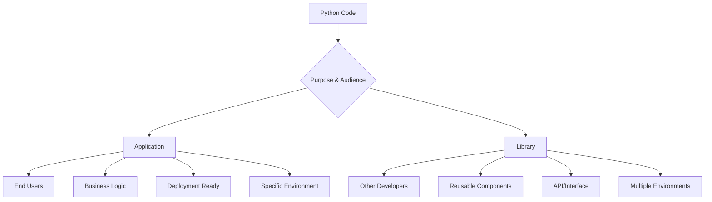

# Application vs Library: Understanding the Distinction

## Fundamental Differences



## Application Characteristics

| Aspect | Application | Example |
|--------|-------------|---------|
| **Primary User** | End users, business stakeholders | Web service, ML pipeline, ETL job |
| **Environment** | Specific, controlled | Production Kubernetes cluster |
| **Dependencies** | Can be pinned to exact versions | `requests==2.31.0` |
| **Configuration** | Environment-specific | Database URLs, API keys |
| **Deployment** | Containerized, executable | Docker image, systemd service |

## Library Characteristics

| Aspect | Library | Example |
|--------|---------|---------|
| **Primary User** | Other developers | `pandas`, `numpy`, internal utilities |
| **Environment** | Multiple, unknown | Various Python versions, platforms |
| **Dependencies** | Flexible version ranges | `requests>=2.25.0,<3.0.0` |
| **Configuration** | Minimal, parameterized | Function parameters, class initialization |
| **Distribution** | Package repositories | PyPI, internal PyPI, Git repositories |

## Real-World Examples at Taboola

```ascii
Application Example: ML Model Serving API
├── src/
│   ├── api/
│   │   ├── __init__.py
│   │   ├── main.py          # FastAPI application
│   │   └── models.py        # Request/response models
│   ├── ml/
│   │   ├── __init__.py
│   │   ├── predictor.py     # Business logic
│   │   └── preprocessor.py  # Data processing
│   └── config/
│       ├── __init__.py
│       └── settings.py      # Environment configuration
├── tests/
├── Dockerfile               # Deployment artifact
├── requirements.txt         # Pinned dependencies
└── docker-compose.yml       # Local development

Library Example: Taboola Data Utils
├── src/
│   └── taboola_data_utils/
│       ├── __init__.py
│       ├── connectors/      # Database connections
│       ├── transformers/    # Data transformation utilities
│       └── validators/      # Data validation functions
├── tests/
├── pyproject.toml           # Package configuration
└── README.md               # Usage documentation
```