# Environment and Dependency Layers

## Environment and Dependency Layers

Every application depends on its environment - from the hardware it runs on to the libraries it imports. These environmental dependencies can be divided into distinct layers, each with its own management challenges.

Understanding these layers helps us choose the right tools and strategies for different project types. Here are the key layers that affect how we manage Python projects:

```mermaid

---
config:

  flowchart:
    subGraphTitleMargin:
      top: 0
      bottom: 30
    defaultRenderer: elk
    rankSpacing: 70
---
graph TB
    subgraph Hardware["(1) Hardware Infrastructure"]
        subgraph OS ["(2) Operating System"]
            direction TB
            SysPkg["(3) System Dependencies<br/>python3-dev, gcc, libjpeg-dev"]
            subgraph Runtime1 ["`(4) Language Runtime: Python 3.12`"]
                direction TB
                subgraph Env1 ["`(5) Runtime Environment: venv`"]
                    direction TB
                    subgraph DepMgmt ["`(6) Dependency Management`"]
                        direction TB
                        numpy1["numpy==1.26.2<br/>↳ requires: python3-dev, gcc"]
                        pillow["Pillow==10.1.0<br/>↳ requires: libjpeg-dev"]
                    end
                end
            end
        end
    end

    %% Tool annotations (outside the containment)
    CloudProvider["☁️ AWS/Google Cloud<br/>(manages layer 1)"]
    ContainerTool["🐳 Docker<br/>(manages layers 2-3)"]
    RuntimeManager["🐍 pyenv/mise/uv<br/>(manages layer 4)"]
    EnvManager["📦 venv/uv<br/>(manages layer 5)"]
    PackageManager["📦 pip/uv<br/>(manages layer 6)"]

    CloudProvider -.->|"provisions"| Hardware
    ContainerTool -.->|"controls"| OS
    RuntimeManager -.->|"installs"| Runtime1
    EnvManager -.->|"creates"| Env1
    PackageManager -.->|"installs"| DepMgmt

    style Hardware fill:#ffebee,stroke:#d84315,stroke-width:4px
    style OS fill:#e3f2fd,stroke:#1565c0,stroke-width:3px
    style SysPkg fill:#e8f5e8,stroke:#2e7d32,stroke-width:3px
    style Runtime1 fill:#fff3e0,stroke:#f57c00,stroke-width:2px
    style Env1 fill:#f3e5f5,stroke:#7b1fa2,stroke-width:2px
    style DepMgmt fill:#fce4ec,stroke:#c2185b,stroke-width:2px
```



**Key Insight**: Each layer wraps and contains the next - showing how isolation works through nested containment.

| Layer | Python Tools | Java Tools | What They Control | Example Usage |
|-------|--------------|------------|-------------------|---------------|
| **1. Hardware Infrastructure** | Cloud providers, physical servers | Cloud providers, physical servers | Physical resources | `AWS EC2`, `Azure VMs` |
| **2. Operating System** | Linux, macOS, Windows, **Docker** | Linux, macOS, Windows | OS kernel & drivers | Ubuntu 22.04 / Windows Server |
| **3. System Dependencies** | `apt`, `brew`, `yum` | `apt`, `brew`, `yum` | System libraries & tools | `apt install python3-dev` / `apt install openjdk-11` |
| **4. Language Runtime** | `pyenv`, `asdf` | `sdkman`, `jenv` | Language version | `pyenv install 3.11` / `sdk install java 11.0.2` |
| **5. Runtime Environment** | `venv`, `conda` | **Classpath** | Language-specific isolation | `python -m venv` / `java -cp libs/*:app.jar` |
| **6. Dependency Management** | `pip`, `uv`, `poetry` + `pyproject.toml` | `mvn`, `gradle` + `pom.xml` | Package resolution & dependency control | `pip install requests` / `mvn install` |


## Why Layer Separation Matters

### Anti-Pattern Examples: When Layer Separation Fails

**Anti-Pattern #1: Using Docker for Python Development Dependencies**
```bash
# ❌ Wrong approach - Docker manages everything
FROM python:3.12
COPY requirements.txt .
RUN pip install -r requirements.txt
COPY . .
# Every dependency change = rebuild entire image (minutes)

# ✅ Right approach - Separate concerns
# Docker: OS + System packages (build once)
# Local venv: Python dependencies (change instantly)
python -m venv .venv && source .venv/bin/activate
pip install requests  # Takes seconds, not minutes
```

**Anti-Pattern #2: Using OS Package Manager for Python Libraries**
```bash
# ❌ Wrong approach
sudo apt install python3-pandas python3-numpy
# Result: Locked to Ubuntu's old versions
# pandas==1.3.5 (from 2021) instead of pandas==2.1.3 (2024)

# ✅ Right approach
uv add pandas numpy
# Result: Latest versions, fast resolution, proper isolation
```

**Anti-Pattern #3: System-Wide Python Environment**
```bash
# ❌ Wrong approach
sudo pip install django==4.2 flask==2.3
# Project A needs Django 4.2, Project B needs Django 5.0
# Result: Version conflicts break both projects

# ✅ Right approach
# Project A: venv with Django 4.2
# Project B: venv with Django 5.0
# Result: Both work independently
```

### Why Layer Separation Works

When you use the right tool for each layer:

**✅ Benefits**:
- **Faster development** - Change only what needs changing (dependencies ≠ rebuild OS)
- **Better isolation** - Projects don't interfere with each other
- **Proper versioning** - Each layer updates at its own pace
- **Team productivity** - No more "works on my machine" problems
- **Maintainability** - Clear separation of concerns

**🔧 Root Causes**:
- **Tool Specialization** - Each tool optimized for its layer's specific problems
- **Update Frequency Separation** - OS patches (monthly) ≠ Python packages (daily)
- **Permission Boundaries** - System tools (root) vs User tools (local)
- **Isolation Mechanisms** - Each layer has its own isolation strategy


## Environment Control by Type

Connecting back to the **Application vs Framework vs Library** concepts, here's how each type controls different environment layers:

**Flexibility Legend:**
- 🌐 **Maximum flexibility** - Works across many contexts
- 🔸 **Moderate flexibility** - Balanced approach
- 🎯 **Minimal flexibility** - Optimized for specific use
- ❌ **No flexibility** - Fixed/constrained

| Environment Layer | 📚 **Library** | 🔧 **Framework** | 🎯 **Application** |
|-------------------|----------------|------------------|-------------------|
| **1. Hardware Infrastructure** | 🌐<br/>Architecture independence | 🌐<br/>Architecture independence | 🌐<br/>Hardware abstraction |
| **2. Operating System** | 🌐<br/>Cross-platform compatibility | 🌐<br/>Cross-platform support | 🔸<br/>Target specific OS |
| **3. System Dependencies** | 🌐<br/>Minimal system requirements | 🌐<br/>Avoid system dependencies | 🔸<br/>Control via containers |
| **4. Language Runtime** | 🌐<br/>Support multiple versions | 🔸<br/>Define supported range | 🎯<br/>Pin optimal version |
| **5. Runtime Environment** | 🌐<br/>Work across isolation types | 🔸<br/>Provide isolation options | 🎯<br/>Choose optimal isolation |
| **6. Dependency Management** | 🔸<br/>Wide version ranges | 🔸<br/>Define plugin contracts | 🎯<br/>Pin exact versions |

## Key Insights

**The Core Trade-off**: More control = More optimization, Less reusability

**The Strategy**: Libraries maximize flexibility, Applications minimize it

**Use the right tool for the right layer** - Each layer has specialized tools optimized for its problems

**Don't overuse a tool to control everything** - This limits flexibility, increases maintenance effort, and makes it difficult to delegate responsibilities to different teams (like platform teams)

---

**Next Section**: [04-python-environment-tools.md](04-python-environment-tools.md) - Python environment tools and patterns
**Previous Section**: [02-application-framework-library.md](02-application-framework-library.md) - Application vs Framework vs Library