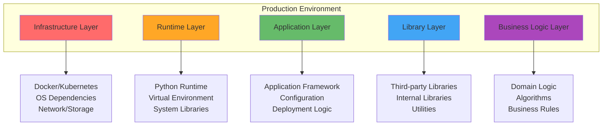

# Production Software Architecture Layers

### The Pyramid of Responsibility



### Layer Responsibilities

| Layer | Responsibility | Who Manages | Example Tools |
|-------|---------------|-------------|---------------|
| **Infrastructure** | Hardware, OS, networking | DevOps/Platform team | Docker, Kubernetes, AWS |
| **Runtime** | Python interpreter, system libs | Platform team + developers | pyenv, asdf, system packages |
| **Application** | App lifecycle, config, deployment | Application developers | FastAPI, Flask, CLI frameworks |
| **Library** | Reusable components, APIs | Library developers | Internal packages, PyPI packages |
| **Business Logic** | Domain-specific functionality | Domain experts + developers | Your actual algorithms |

### Twelve-Factor App Principles (Python Context)

The [Twelve-Factor App](https://12factor.net/) methodology provides guidelines for building software-as-a-service apps. Here are the most relevant factors for Python applications:

#### 1. Codebase
```bash
# One codebase, many deploys
git repository → multiple environments (dev, staging, prod)
```

#### 2. Dependencies
```python
# Explicitly declare and isolate dependencies
# requirements.txt or pyproject.toml
# Virtual environments or containers
```

#### 3. Config
```python
# Store config in environment variables, not in code
import os

DATABASE_URL = os.environ["DATABASE_URL"]  # ✅ Good
DATABASE_URL = "postgresql://localhost/db"  # ❌ Bad
```

#### 4. Backing Services
```python
# Treat backing services as attached resources
# Database, cache, queue - all accessed via URLs/config
```

#### 5. Build, Release, Run
```bash
# Strict separation between build and run stages
Build:   Create deployment artifact (Docker image)
Release: Combine build with config
Run:     Execute the application
```
