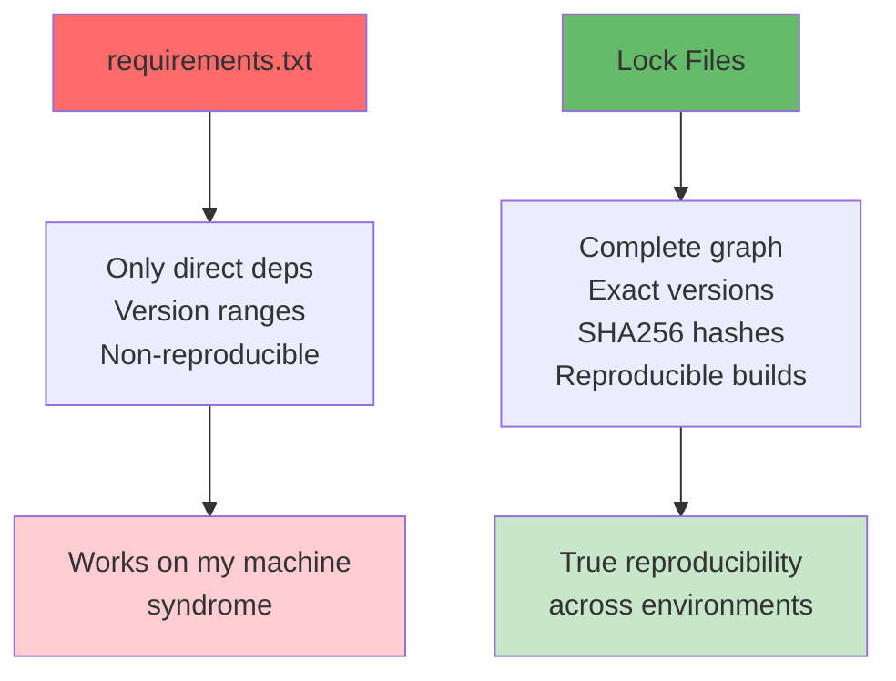
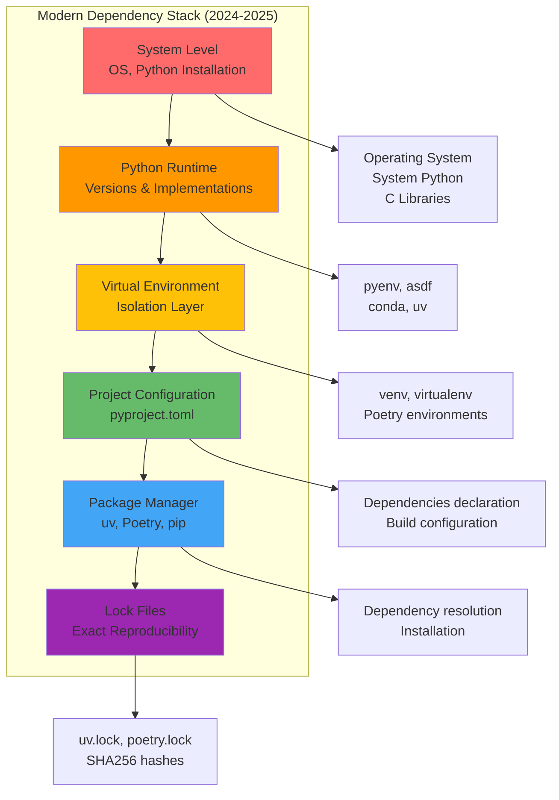

# Dependency Management Strategy

### The Lock File Revolution (2024-2025)

Python packaging has transformed dramatically with lock files by modern tools like uv and Poetry. Unlike traditional requirements.txt files that only capture direct dependencies, **lock files record the complete dependency graph including all transitive dependencies with cryptographic hashes**.

#### Key Advantages of Lock Files



#### Lock File Strategy by Project Type

| Project Type | Commit Lock Files? | Reasoning |
|--------------|-------------------|----------|
| **Applications** | ✅ Always | Production reproducibility critical |
| **Libraries** | ⚠️ Maybe | Development consistency vs downstream compatibility |
| **Monorepos** | ✅ Usually | Team coordination benefits |

### Modern Dependency Hierarchy - Six Layers



### System Dependencies
**Responsibility**: Infrastructure & Platform teams
**Scope**: Operating system level

```dockerfile
# Dockerfile example
FROM python:3.11-slim

# System dependencies
RUN apt-get update && apt-get install -y \
    libpq-dev \
    gcc \
    && rm -rf /var/lib/apt/lists/*
```

```yaml
# docker-compose.yml
services:
  app:
    build: .
    depends_on:
      - postgres
      - redis
```

### Application Dependencies
**Responsibility**: Application developers
**Scope**: Application runtime

```toml
# pyproject.toml for applications
[project]
dependencies = [
    "fastapi==0.104.1",      # Pinned for stability
    "uvicorn==0.24.0",       # Exact versions for reproducibility
    "sqlalchemy==2.0.23",   # Known working combinations
    "pydantic==2.5.0",
]
```

```txt
# requirements.txt (alternative)
fastapi==0.104.1
uvicorn[standard]==0.24.0
sqlalchemy==2.0.23
pydantic==2.5.0
```

### Library Dependencies
**Responsibility**: Library developers
**Scope**: Broad compatibility

```toml
# pyproject.toml for libraries
[project]
dependencies = [
    "requests>=2.25.0,<3.0.0",    # Compatible range
    "pydantic>=2.0.0,<3.0.0",     # Major version compatibility
    "typing-extensions>=4.0.0; python_version<'3.11'",  # Conditional
]
```

### Dependency Resolution Example

```ascii
Application: ML Model API (v1.0.0)
├── fastapi==0.104.1
│   ├── starlette==0.27.0
│   └── pydantic>=1.6.2,!=1.7,!=1.7.1,!=1.7.2,!=1.7.3,!=1.8,!=1.8.1,<3.0.0
├── taboola-ml-utils>=2.1.0,<3.0.0  # Internal library
│   ├── pandas>=1.5.0,<3.0.0
│   ├── numpy>=1.21.0,<2.0.0
│   └── scikit-learn>=1.0.0,<2.0.0
└── prometheus-client==0.19.0

Resolution Result:
✅ pydantic==2.5.0        (satisfies both constraints)
✅ pandas==2.1.4          (latest compatible)
✅ numpy==1.26.2          (latest compatible)
❌ Conflict detected: Package X requires Y>=2.0, Package Z requires Y<2.0
```
