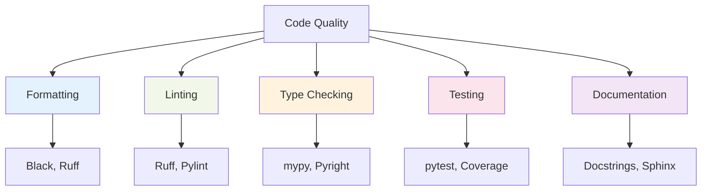

# Development Practices & Quality Assurance

### Code Quality Pyramid



### 1. Code Formatting

**Goal**: Consistent, readable code without debates

```python
# .pre-commit-config.yaml
repos:
  - repo: https://github.com/psf/black
    rev: 23.11.0
    hooks:
      - id: black
        language_version: python3.11

  - repo: https://github.com/charliermarsh/ruff-pre-commit
    rev: v0.1.6
    hooks:
      - id: ruff
        args: [--fix, --exit-non-zero-on-fix]
```

```toml
# pyproject.toml
[tool.black]
line-length = 88
target-version = ['py311']
include = '\.pyi?$'

[tool.ruff]
line-length = 88
target-version = "py311"
select = [
    "E",   # pycodestyle errors
    "W",   # pycodestyle warnings
    "F",   # pyflakes
    "I",   # isort
    "B",   # flake8-bugbear
    "C4",  # flake8-comprehensions
    "UP",  # pyupgrade
]
```

### 2. Type Checking with mypy

**Goal**: Catch type-related bugs before runtime

```python
# Good: Type annotations
from typing import List, Optional, Dict, Any
from dataclasses import dataclass

@dataclass
class User:
    id: int
    name: str
    email: Optional[str] = None

def process_users(users: List[User]) -> Dict[int, str]:
    """Process users and return id to name mapping."""
    return {user.id: user.name for user in users}

# Better: Using modern Python 3.11+ syntax
def process_users(users: list[User]) -> dict[int, str]:
    """Process users and return id to name mapping."""
    return {user.id: user.name for user in users}
```

```toml
# pyproject.toml
[tool.mypy]
python_version = "3.11"
warn_return_any = true
warn_unused_configs = true
disallow_untyped_defs = true
disallow_incomplete_defs = true
check_untyped_defs = true
disallow_untyped_decorators = true
no_implicit_optional = true
warn_redundant_casts = true
warn_unused_ignores = true
warn_no_return = true
warn_unreachable = true
strict_equality = true
```

### 3. Testing with pytest

**Goal**: Reliable, maintainable test suite

```python
# tests/test_user_service.py
import pytest
from unittest.mock import Mock, patch
from myapp.services.user_service import UserService
from myapp.models.user import User

class TestUserService:
    @pytest.fixture
    def mock_database(self):
        return Mock()

    @pytest.fixture
    def user_service(self, mock_database):
        return UserService(database=mock_database)

    def test_get_user_success(self, user_service, mock_database):
        # Arrange
        expected_user = User(id=1, name="John Doe", email="john@example.com")
        mock_database.get_user.return_value = expected_user

        # Act
        result = user_service.get_user(1)

        # Assert
        assert result == expected_user
        mock_database.get_user.assert_called_once_with(1)

    def test_get_user_not_found(self, user_service, mock_database):
        # Arrange
        mock_database.get_user.return_value = None

        # Act & Assert
        with pytest.raises(UserNotFoundError):
            user_service.get_user(999)

    @pytest.mark.parametrize("user_id,expected", [
        (1, "john@example.com"),
        (2, "jane@example.com"),
        (3, None),
    ])
    def test_get_user_email(self, user_service, mock_database, user_id, expected):
        # Parameterized test example
        user = User(id=user_id, name="Test", email=expected)
        mock_database.get_user.return_value = user

        result = user_service.get_user_email(user_id)

        assert result == expected
```

```toml
# pyproject.toml
[tool.pytest.ini_options]
testpaths = ["tests"]
python_files = ["test_*.py", "*_test.py"]
python_classes = ["Test*"]
python_functions = ["test_*"]
addopts = [
    "--strict-markers",
    "--strict-config",
    "--cov=src",
    "--cov-report=term-missing",
    "--cov-report=html:htmlcov",
    "--cov-fail-under=80",
]
markers = [
    "slow: marks tests as slow (deselect with '-m \"not slow\"')",
    "integration: marks tests as integration tests",
]
```

### 4. Testing Strategy

```ascii
Testing Pyramid

              /\
             /  \
            /    \
           /  E2E \          <- Few, slow, expensive
          /________\
         /          \
        /Integration \       <- Some, medium speed
       /______________\
      /                \
     /   Unit Tests     \    <- Many, fast, cheap
    /____________________\
```

| Test Type | Purpose | Tools | Example |
|-----------|---------|-------|---------|
| **Unit** | Individual functions/classes | pytest, unittest.mock | Test `calculate_score()` function |
| **Integration** | Component interactions | pytest, testcontainers | Test API + Database |
| **End-to-End** | Full user workflows | pytest, playwright, requests | Test complete ML pipeline |
