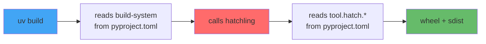
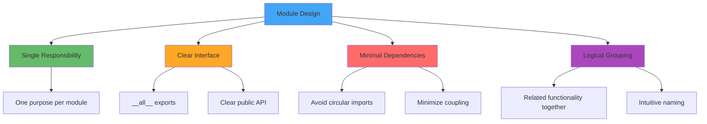

# Section 05: Library Repository Structure & pyproject.toml Design

> How modern Python libraries organize code and define metadata for maximum reusability

## Learning Objectives

- Understand standard Python library repository structure
- Master pyproject.toml design for library projects
- Compare uv and hatch approaches for library development
- Design effective module and subpackage organization
- Learn library distribution and publishing workflows
- Apply environment control principles to library structure

## Repository Structure for Python Libraries

### Standard Library Layout

```
my-awesome-library/                    # Library structure
├── src/                               # Libraries use src/ layout for testing isolation
│   └── my_awesome_library/            # Package will be pip-installable
│       ├── __init__.py
│       ├── core.py
│       ├── utils.py
│       └── preprocessing/             # Subpackage example
│           ├── __init__.py
│           ├── text.py
│           ├── numerical.py
│           └── validation.py
├── tests/                             # Mirror source structure
│   ├── conftest.py
│   ├── test_core.py
│   ├── test_utils.py
│   └── test_preprocessing/
│       ├── test_text.py
│       ├── test_numerical.py
│       └── test_validation.py
├── docs/
│   ├── conf.py
│   ├── index.md
│   └── api.md
├── pyproject.toml                     # Modern Python packaging
├── README.md
├── LICENSE
├── CHANGELOG.md
└── .gitignore
```

### Why This Structure?

| Component | Purpose | Environment Control Impact |
|-----------|---------|---------------------------|
| `src/` layout | **For libraries**: Prevents accidental imports during testing.<br>*Applications use flat layout since they aren't pip-installed* | Enforces clean namespace |
| `tests/` separate | Clear separation of concerns, mirrors source structure | Tests run in different environments |
| `docs/` | Centralized documentation | May have own dependencies |
| `pyproject.toml` | Single source of truth | Defines dependency flexibility |


### The `src/` Layout Advantage (For Libraries)

```python
# Library with src/ layout (recommended)
my_library/
├── src/                 # Package is isolated in src/
│   └── my_library/      # Can't be imported without installation
│       └── core.py
└── tests/
    └── test_core.py     # Forces proper package installation

# Application (flat layout is fine)
my_app/
├── my_app/              # Not installed via pip
│   └── main.py
└── tests/               # No import isolation needed
```

## pyproject.toml: The Heart of Modern Python Libraries

### Understanding Python Tool Categories

Before diving into pyproject.toml structure, it's crucial to understand that Python packaging tools fall into **two distinct categories**:

**1. Build Backend** - Creates distribution packages (wheels/sdist)
- Reads your source code and pyproject.toml
- Generates installable packages for PyPI

**2. Project Management** - Manages dependencies and development workflow  
- `uv add numpy` - adds dependencies to pyproject.toml
- `uv sync` - creates virtual environment and installs dependencies
- `uv build` - calls the build backend to create packages

#### Python Packaging Tool Categories

| Tool | Build Backend | Project Management | Key Strengths | Best For |
|------|---------------|-------------------|---------------|----------|
| **setuptools** | ✅ `setuptools>=61` | 🔧 Basic | Traditional, broad compatibility | Legacy projects |
| **flit** | ✅ `flit_core` | 🔧 Basic | Minimalist | Simple pure-Python |
| **uv** | ❌ | ✅ Full | Speed (10-100x), no lock-in | Fast development |
| **poetry** | ✅ `poetry-core` | ✅ Full | Integrated solution | All-in-one experience |
| **pdm** | ✅ `pdm-backend` | ✅ Full | Standards-compliant | Modern development |
| **hatch** | ✅ `hatchling` | ✅ Full | Rich features, matrices | Complex workflows |
| **pip-tools** | ❌ | 🔧 Partial | Dependency resolution | Minimalist locking |
| **twine** | ❌ | 🔧 Publishing | Secure uploads | PyPI publishing |

### Understanding the Build System

#### How `uv build` Actually Works



**Key Point**: `uv` is **not** a build tool - it's an interface that calls the actual build backend!

#### Key Concept: Different Tools, Different Configuration Sections

```toml
[build-system]
build-backend = "hatchling.build"  # Tells uv which backend to call

[tool.hatch.*]           # Hatchling's configuration
[tool.setuptools.*]      # Setuptools' configuration
[tool.poetry.*]          # Poetry's configuration
[tool.uv.*]              # uv's configuration (development only)
```

**Important**: Each tool reads its own `[tool.toolname.*]` section in pyproject.toml.

### Basic Structure

```toml
[build-system]
requires = ["hatchling"]  # or ["setuptools>=61", "wheel"]
build-backend = "hatchling.build"

[project]
name = "my-awesome-library"
version = "0.1.0"
description = "A library that does awesome things"
readme = "README.md"
requires-python = ">=3.8"
license = {text = "MIT"}
authors = [
    {name = "Your Name", email = "you@example.com"},
]
keywords = ["awesome", "library", "python"]
classifiers = [
    "Development Status :: 4 - Beta",
    "Intended Audience :: Developers",
    "License :: OSI Approved :: MIT License",
    "Programming Language :: Python :: 3",
    "Programming Language :: Python :: 3.8",
    "Programming Language :: Python :: 3.9",
    "Programming Language :: Python :: 3.10",
    "Programming Language :: Python :: 3.11",
    "Programming Language :: Python :: 3.12",
]
dependencies = [
    "numpy>=1.20,<2.0",  # Flexible: library has no environment control
    "requests>=2.25",
    "pydantic>=2.0,<3.0",
]

[project.urls]
Homepage = "https://your-company.com/my-awesome-library"
Documentation = "https://docs.your-company.com/my-awesome-library"
Repository = "https://git.your-company.com/my-awesome-library"
Issues = "https://tickets.your-company.com/my-awesome-library"

# Build backend configuration - tells the build tool where to find source code
[tool.hatch.build.targets.wheel]
packages = ["src/my_awesome_library"]  # For hatchling

# Alternative: if using setuptools
# [tool.setuptools.packages.find]
# where = ["src"]
```

### Library Dependency Specification: Flexible vs Restrictive

Remember from Section 02: **Libraries have no environment control**, so they must use flexible version constraints:

```toml
# ❌ BAD: Overly restrictive for libraries
dependencies = [
    "numpy==1.21.0",        # Too restrictive! Conflicts with user's numpy
    "requests~=2.28.0",     # Unnecessarily narrow version range
]

# ✅ GOOD: Flexible version ranges for libraries
dependencies = [
    "numpy>=1.20,<2.0",     # Major version constraint
    "requests>=2.25",       # Minimum version only  
    "pydantic>=2.0,<3.0",   # Known breaking changes at major versions
]
```

**Why flexible constraints matter:**
- Libraries install into **shared environments** with other packages
- Restrictive versions cause dependency conflicts for users
- Users should control exact versions, not libraries

### Understanding optional-dependencies vs dependency-groups

Python has two different standards for managing extra dependencies:

| Feature | optional-dependencies (PEP 621) | dependency-groups (PEP 735) |
|---------|--------------------------------|----------------------------|
| **Purpose** | Extra features for end users | Development tools |
| **Included in package** | ✅ Yes, in metadata | ❌ No |
| **Installation** | `pip install pkg[extra]` | `uv sync --group dev` |
| **Use cases** | Visualization, ML backends, DB drivers | Testing, linting, docs |
| **Standard maturity** | Mature (2020) | New (2024) |
| **pip support** | ✅ Install only | ✅ Since v25.1 (2025-04) |
| **uv support** | ✅ Full support | ✅ Full support |
| **Poetry support** | ✅ Since 2023 | 🔄 In progress |
| **setuptools support** | ✅ Via pyproject.toml | ❌ Not supported |

#### For End Users: optional-dependencies (PEP 621)
```toml
[project.optional-dependencies]
viz = ["matplotlib>=3.5", "seaborn>=0.12"]  # pip install mylib[viz]
ml = ["scikit-learn>=1.0", "pandas>=1.5"]   # pip install mylib[ml]
docs = ["sphinx>=5.0", "sphinx-rtd-theme>=1.0"]
```

#### For Developers: dependency-groups (PEP 735)
```toml
[dependency-groups]
dev = [
    "pytest>=7.0",
    "pytest-cov>=4.0",
    "mypy>=1.0",
    "ruff>=0.1.0",
]
lint = ["ruff>=0.1.0", "mypy>=1.0"]
test = ["pytest>=7.0", "pytest-cov>=4.0", "pytest-xdist>=3.0"]
docs = ["sphinx>=5.0", "mkdocs>=1.5"]
```

### uv init Options for Different Project Types

#### Library Project: `uv init --lib my-awesome-library`

**Creates this structure:**
```
my-awesome-library/
├── pyproject.toml              # Project configuration
├── README.md                   # Auto-generated documentation
├── src/                        # Source code (src/ layout)
│   └── my_awesome_library/     # Package (note: underscores)
│       └── __init__.py         # Package entry point
└── tests/                      # Test directory
    └── __init__.py
```

#### Application Project: `uv init --app my-app`

**Creates this structure:**
```
my-app/
├── pyproject.toml              # Project configuration  
├── README.md                   # Auto-generated documentation
├── src/                        # Source code
│   └── my_app/
│       ├── __init__.py
│       └── main.py             # Application entry point
└── tests/
    └── __init__.py
```

### Essential uv Commands for Library Developers

```bash
# Initialize new library project (creates pyproject.toml + src layout)
uv init --lib my-awesome-library

# Add dependencies (automatically updates pyproject.toml)
uv add numpy pandas                # Add runtime dependencies
uv add --group dev pytest ruff    # Add development dependencies

# Development workflow (automatically creates virtual environment)
uv sync --all-groups              # Creates .venv/ + installs all dependency groups
uv sync --group test              # Creates .venv/ + installs specific groups

# Test your library as end users would
uv pip install -e ".[viz,ml]"     # Test optional dependencies
python -c "import my_awesome_library"  # Verify installation

# Test with development dependencies override
uv sync --frozen                  # Use exact versions from uv.lock

# Build and verify distribution packages
uv build                          # uv calls your build backend (e.g., hatchling)
uv pip install dist/my_awesome_library-*.whl  # Test wheel locally

# Check what will be published (these settings won't be included)
tar -tzf dist/my_awesome_library-*.tar.gz  # Inspect source distribution
```

**Important**:
- All `[tool.uv.*]` sections are **for library developers only**
- End users installing your library (`pip install your-lib`) never see these settings
- These settings are ignored when your library is published to PyPI

### Why Use uv?

**Key Advantages:**
- **Speed**: 10-100x faster than pip for development workflows
- **Standards Support**: Full support for PEP 621 and PEP 735
- **Compatibility**: Generates standard pyproject.toml that works with all tools
- **No Lock-in**: Your library remains pip-installable for end users

### Development Performance Comparison

| Operation | pip | uv | Impact on Development |
|-----------|-----|-----|----------------------|
| Create venv | 2-3s | <0.1s | Faster iteration |
| Install test deps | 10-30s | 1-2s | Faster CI/CD |
| Resolve dependencies | 30s+ | 1-2s | Faster development setup |
| Rebuild after changes | 15s+ | 1s | Better developer experience |

**Important Notes:**
- **End users unaffected**: `pip install your-lib` works identically regardless of your dev setup
- **Developer-only settings**: All `[tool.uv]` configurations are for development only
- **Standard compliance**: Your published package follows PEP standards and works with all tools

### uv vs Hatch for Library Development

| Feature | uv | Hatch |
|---------|----|---------|
| Speed | ⚡ 10-100x faster | 🐌 Standard Python speed |
| Python management | ✅ Built-in | ✅ Built-in |
| Environment matrices | ❌ Manual setup | ✅ Native support (`hatch test -py 3.10,3.11,3.12`) |
| Version management | ❌ Manual | ✅ Automated (`hatch version minor`) |
| Build backend | 🔧 Any (setuptools, hatch, etc.) | 🏗️ Hatchling (recommended) |
| Testing workflow | 📦 Basic | 🎯 Rich (`hatch test --cover --all`) |

**Use uv when:**
- Speed is critical (large dependencies)
- Simple library development
- Team already uses uv for applications
- Rapid iteration during development

**Use Hatch when:**
- **Public library development** (matrix testing across Python versions)
- Need automated version management and publishing
- Complex testing workflows with coverage
- Multiple environment management (test, docs, lint separately)


## Module and Subpackage Design

### Design Principles



### Common Anti-Patterns to Avoid

#### Fat __init__.py Files

**❌ DON'T:**
```python
from .module1 import *  # Makes namespace unclear
from .module2 import *  # Can cause conflicts
from .module3 import *  # Breaks import traceability
```

**✅ DO:**
```python
from .module1 import ClassA, function_b
from .module2 import utility_function
from .module3 import IMPORTANT_CONSTANT

__all__ = [
    "ClassA",
    "function_b", 
    "utility_function",
    "IMPORTANT_CONSTANT",
]
```

#### Deep Nesting Without Purpose

**❌ DON'T:**
```
mypackage/
├── core/
│   └── utils/
│       └── helpers/
│           └── functions/
│               └── basic.py  # Too deep!
```

**✅ DO:**
```
my_library/
├── __init__.py
├── preprocessing/
│   ├── __init__.py
│   ├── text.py          # Clear purpose
│   └── validation.py
├── models/
│   ├── __init__.py
│   └── base.py
└── evaluation/
    ├── __init__.py
    └── metrics.py
```

#### Circular Imports

**❌ DON'T:**
```python
# models.py
from .services import ModelService  # Imports services

# services.py
from .models import Model  # Imports models -> circular!
```

**✅ DO:**
```python
# shared.py
class BaseModel:
    pass

# models.py
from .shared import BaseModel

# services.py  
from .shared import BaseModel
```

#### Side Effects in Package Initialization

**❌ DON'T:**
```python
# __init__.py with side effects
import requests
import os

# Side effects during import - BAD!
API_KEY = os.environ["SECRET_API_KEY"]  # Crashes if env var missing
response = requests.get("https://api.example.com/config")  # Network call on import!
DEFAULT_CONFIG = response.json()
```

**✅ DO:**
```python
# Lazy initialization
def get_config():
    """Get config when actually needed."""
    if not hasattr(get_config, '_cache'):
        response = requests.get("https://api.example.com/config")
        get_config._cache = response.json()
    return get_config._cache
```

#### Exposing Internal Implementation

**❌ DON'T:**
```python
# my_library/__init__.py
from .internal_utils import _private_helper, _debug_function
from .core import PublicClass
from .helpers import utility_function

__all__ = [
    "PublicClass", 
    "utility_function",
    "_private_helper",  # Exposing private internals - BAD!
    "_debug_function",  # Users shouldn't depend on this
]
```

**✅ DO:**
```python
# my_library/__init__.py
from .core import PublicClass
from .helpers import utility_function

__all__ = [
    "PublicClass",
    "utility_function", 
]
```

#### Missing Graceful Degradation

**❌ DON'T:**
```python
# my_library/visualization.py
import matplotlib.pyplot as plt  # Hard dependency - crashes if not installed

def create_plot(data):
    plt.plot(data)  # Fails if matplotlib not available
```

**✅ DO:**
```python
# Optional dependencies with graceful fallback  
try:
    import matplotlib.pyplot as plt
    HAS_MATPLOTLIB = True
except ImportError:
    HAS_MATPLOTLIB = False

def create_plot(data):
    if not HAS_MATPLOTLIB:
        raise ImportError("matplotlib required for plotting. Install with: pip install matplotlib")
    plt.plot(data)
```


## Environment Control in Practice

Remember from Section 02: **Libraries have no environment control**

This drives every structural decision:

1. **Flexible dependencies** → Wide compatibility
2. **src/ layout** → Clean testing environments
3. **Optional dependencies** → Let users control extras
4. **Multiple Python versions** → Maximum reusability
5. **Type hints** → Help users without forcing mypy

## Advanced pyproject.toml Configuration

### Python Version Support

```toml
requires-python = ">=3.8"  # Support wide range

[tool.cibuildwheel]
# Build wheels for multiple Python versions
build = "cp38-* cp39-* cp310-* cp311-* cp312-*"
```

### Scripts - Creating Command Line Tools

```toml
[project.scripts]
# Creates executable commands users can run in terminal
awesome-tool = "my_awesome_library.cli:main"  # Creates `awesome-tool` command
data-processor = "my_awesome_library.processor:run"  # Creates `data-processor` command
```

**Result**: After `pip install my-awesome-library`, users can run:
```bash
$ awesome-tool --help
$ data-processor input.csv
```

**Use when**: Your library provides command-line utilities for end users.

### Entry Points - Plugin Discovery System

```toml
[project.entry-points."my_framework.plugins"] 
awesome = "my_awesome_library.plugins:AwesomePlugin"  # Register plugin for other frameworks
```

**Result**: Other frameworks can discover and load your plugin:
```python
# Framework code can find your plugin
import pkg_resources
for entry_point in pkg_resources.iter_entry_points('my_framework.plugins'):
    plugin_class = entry_point.load()  # Loads AwesomePlugin
```

**Use when**: Your library extends other frameworks or applications as a plugin.

### Testing Configuration

```toml
[tool.pytest.ini_options]
minversion = "7.0"
addopts = [
    "--cov=my_awesome_library",
    "--cov-report=term-missing",
    "--cov-report=html",
]
testpaths = ["tests"]

[tool.coverage.run]
source = ["src/my_awesome_library"]
branch = true

[tool.coverage.report]
exclude_lines = [
    "pragma: no cover",
    "def __repr__",
    "raise AssertionError",
    "raise NotImplementedError",
]
```

## Real-World Example: requests Library

```toml
# Simplified requests pyproject.toml structure
[project]
name = "requests"
dependencies = [
    "charset-normalizer>=2,<4",  # Flexible
    "idna>=2.5,<4",             # Flexible
    "urllib3>=1.21.1,<3",       # Flexible
    "certifi>=2017.4.17",       # Very flexible
]

[project.optional-dependencies]
security = ["pyOpenSSL>=0.14", "cryptography>=1.3.4"]
socks = ["PySocks>=1.5.6,!=1.5.7"]
use_chardet_on_py3 = ["chardet>=3.0.2,<6"]
```

Notice: No pinned versions! Maximum flexibility for users.

## Library Distribution and Publishing

### Basic Workflow

```bash
# 1. Build packages
uv build                    # Creates dist/ with .whl and .tar.gz

# 2. Test locally  
pip install dist/*.whl      # Test your wheel works

# 3. Upload to PyPI
pip install twine           # Publishing tool
twine upload dist/*         # Requires PyPI account + API token
```

### Key Concepts

- **Wheel (.whl)**: Fast binary format for installation
- **Source Distribution (.tar.gz)**: Source code package  
- **PyPI**: The Python Package Index where libraries are published
- **Semantic Versioning**: `1.2.3` → `1.2.4` (patch) → `1.3.0` (minor) → `2.0.0` (major)

## Summary

Library repository structure reflects the fundamental principle of **no environment control**:

- **src/ layout**: Ensures clean separation and proper testing
- **Flexible dependencies**: Work in many environments
- **Rich metadata**: Help users make informed choices
- **Modern tooling**: uv for speed, hatch for features
- **Testing isolation**: Verify behavior across environments
- **Clear module design**: Single responsibility, logical organization
- **Distribution workflow**: Automated building and publishing
- **Version management**: Semantic versioning for compatibility

Next: Section 06 - Evolution of Modern Python Tools