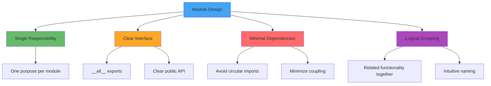

# Section 06: Module and Subpackage Design

> **Environment Control Focus**: How library code organization impacts downstream environments

## Module and Subpackage Design

### Design Principles



### Common Anti-Patterns to Avoid

#### 1. Wildcard Imports in __init__.py

**❌ DON'T:**
```python
from .module1 import *  # Unclear namespace
from .module2 import *  # Name conflicts
```

**✅ DO:**
```python
from .module1 import ClassA, function_b
__all__ = ["ClassA", "function_b"]
```

#### 2. Deep Nesting Without Purpose

**❌ DON'T:**
```
mypackage/
├── core/
│   └── utils/
│       └── helpers/
│           └── functions/
│               └── basic.py  # 5 levels deep! What does this do?
```

**✅ DO:**
```
mypackage/
├── preprocessing/
│   ├── text.py      # Clear purpose: text preprocessing
│   └── numerical.py # Clear purpose: numerical preprocessing
└── models/
    └── base.py      # 2-3 levels max, obvious function
```

#### 3. Side Effects During Import

**❌ DON'T:**
```python
# __init__.py
API_KEY = os.environ["SECRET_KEY"]  # Crashes on import!
import matplotlib.pyplot as plt      # Crashes if matplotlib not installed!

# visualization.py
from matplotlib import pyplot as plt  # Import at module level
plt.style.use('seaborn')              # Side effect during import!
```

**✅ DO:**
```python
# __init__.py  
def get_api_key():
    return os.environ["SECRET_KEY"]  # Called when needed

# visualization.py - Safe optional dependency handling
try:
    import matplotlib.pyplot as plt
    HAS_MATPLOTLIB = True
except ImportError:
    plt = None
    HAS_MATPLOTLIB = False

def create_plot():
    if not HAS_MATPLOTLIB:
        raise ImportError("matplotlib required for plotting. Install with: pip install matplotlib")
    # ... actual plotting code
```

### Namespace Pollution Examples

#### The Impact of Poor __all__ Definition

```python
# Without __all__ - Everything is exposed!
# mypackage/utils.py
_CACHE = {}  # Private global
TEMP_DIR = "/tmp"  # Module constant

def public_function():
    pass

def _private_helper():  # Convention: _ prefix
    pass

# User code - namespace pollution!
from mypackage.utils import *
print(_CACHE)  # Uh oh, accessing internals!
```

**Solution:**
```python
# mypackage/utils.py
__all__ = ["public_function", "TEMP_DIR"]  # Explicit exports only!
```

## Advanced Import Management

### Lazy Loading for Performance

```python
# mypackage/heavy_module.py
class LazyImporter:
    def __init__(self, module_name):
        self._module_name = module_name
        self._module = None
    
    def __getattr__(self, attr):
        if self._module is None:
            self._module = importlib.import_module(self._module_name)
        return getattr(self._module, attr)

# Usage in __init__.py
pandas = LazyImporter("pandas")  # Only imported when actually used
```

### Import Hooks for Development

```python
# mypackage/__init__.py
import sys

class ImportProfiler:
    """Debug tool to track import times"""
    def __init__(self):
        self.import_times = {}
        
    def find_module(self, fullname, path=None):
        if fullname.startswith('mypackage'):
            return self
        return None
        
    def load_module(self, fullname):
        import time
        start = time.time()
        
        # Actually load the module
        if fullname in sys.modules:
            return sys.modules[fullname]
            
        # ... loading logic ...
        
        self.import_times[fullname] = time.time() - start
        return module

# Enable in development
if os.environ.get('DEBUG_IMPORTS'):
    sys.meta_path.insert(0, ImportProfiler())
```

## Real-World Patterns

### Plugin System Design

```python
# mypackage/plugins/__init__.py
import pkgutil
import importlib

discovered_plugins = {}

# Auto-discover all plugins in this package
for finder, name, ispkg in pkgutil.iter_modules(__path__, __name__ + "."):
    if not ispkg:  # Only load modules, not subpackages
        module = importlib.import_module(name)
        if hasattr(module, 'PLUGIN_NAME'):
            discovered_plugins[module.PLUGIN_NAME] = module

# Public API
def get_plugin(name):
    return discovered_plugins.get(name)
```

### Conditional Feature Loading

```python
# mypackage/features/__init__.py
import sys

# Feature detection
FEATURES = {
    'advanced_math': 'numpy' in sys.modules,
    'plotting': 'matplotlib' in sys.modules,
    'ml_support': 'sklearn' in sys.modules
}

# Conditional imports based on available features
if FEATURES['advanced_math']:
    from .advanced import *
else:
    from .basic import *  # Fallback implementations
```

## Best Practices Summary

| Aspect | Good Practice | Why It Matters |
|--------|--------------|----------------|
| **Imports** | Use explicit imports with `__all__` | Prevents namespace pollution |
| **Structure** | Maximum 3 levels of nesting | Maintains discoverability |
| **Dependencies** | Lazy-load heavy dependencies | Reduces import time |
| **Side Effects** | No side effects during import | Ensures predictable behavior |
| **Optional Deps** | Graceful handling with try/except | Allows partial functionality |

## Impact on Downstream Users

### Environment Control Implications

1. **Clear imports** → Users know what they're getting
2. **No side effects** → Safe to import in any environment
3. **Lazy loading** → Fast imports in constrained environments
4. **Optional dependencies** → Works in minimal environments

### Testing Considerations

```python
# Easy to mock when imports are explicit
from mypackage import specific_function  # ✅ Easy to patch

# Hard to test with wildcard imports
from mypackage import *  # ❌ What needs mocking?
```

---

**Next Section**: [07-python-packaging-before-modern-era.md](07-python-packaging-before-modern-era.md) - The Wild West years
**Previous Section**: [05-library-repository-structure.md](05-library-repository-structure.md) - Complete repository organization