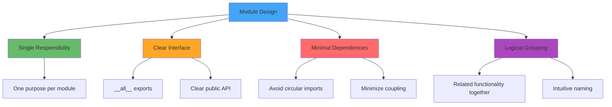

# Create new project with lock file
uv init taboola-project
cd taboola-project

# Add dependencies (generates uv.lock automatically)
uv add fastapi uvicorn pydantic
uv add --dev pytest ruff mypy

# Install and run (uses lock file for reproducibility)
uv sync
uv run python -m pytest
```

#### uv.lock File Benefits

```toml
# uv.lock - machine-generated, never edit manually
# Contains exact versions + SHA256 hashes for security
# Multi-platform resolution in single file
# Cryptographic verification prevents supply chain attacks
```

### Source Layout: The Modern Standard

The **src vs flat layout debate** has largely been resolved in favor of src layout for 2024-2025:

#### Layout Comparison

```ascii
Flat Layout (Traditional)          src Layout (Modern Standard)

myproject/                         myproject/
├── myproject/                     ├── src/
│   ├── __init__.py               │   └── myproject/
│   └── core.py                   │       ├── __init__.py
├── tests/                        │       └── core.py
└── pyproject.toml                ├── tests/
                                  └── pyproject.toml
```

#### Why src Layout Wins

| Issue | Flat Layout Problem | src Layout Solution |
|-------|------------------|-------------------|
| **Import Safety** | Can import from dev directory | Forces testing installed package |
| **Packaging Issues** | Hidden until deployment | Caught early in development |
| **Production Mirror** | Dev ≠ Production | Dev environment matches production |
| **Tool Support** | PyOpenSci, PyPA recommend src | Industry consensus emerging |

#### Tool Positions (2024-2025)

- **Poetry**: Switched to src layout default in 2025
- **uv**: Uses flat layout for "immediate feedback" 
- **PyOpenSci**: Strongly recommends src layout
- **PyPA Documentation**: Increasingly favors src layout

**Recommendation**: Use src layout for new projects unless specific requirements favor flat layout.

### Module and Subpackage Design

Designing effective module and subpackage structures is crucial for maintainable Python libraries and applications. Good design promotes **discoverability**, **logical organization**, and **clear separation of concerns**.

#### Module Design Principles



#### Package Structure Patterns

##### 1. Functional Organization (Recommended for Libraries)

```ascii
taboola_ml_utils/
├── __init__.py           # Main package interface
├── preprocessing/        # Data preprocessing functions
│   ├── __init__.py
│   ├── text.py          # Text preprocessing
│   ├── numerical.py     # Numerical data processing
│   └── validation.py    # Data validation
├── models/              # ML model utilities
│   ├── __init__.py
│   ├── base.py          # Base model classes
│   ├── sklearn_utils.py # Scikit-learn extensions
│   └── torch_utils.py   # PyTorch utilities
├── evaluation/          # Model evaluation tools
│   ├── __init__.py
│   ├── metrics.py       # Custom metrics
│   └── visualization.py # Evaluation plots
└── io/                  # Input/output utilities
    ├── __init__.py
    ├── database.py      # Database connections
    └── cloud.py         # Cloud storage interfaces
```

##### 2. Layered Organization (Recommended for Applications)

```ascii
ml_serving_app/
├── __init__.py
├── api/                 # Presentation layer
│   ├── __init__.py
│   ├── routes/          # API endpoints
│   │   ├── __init__.py
│   │   ├── predictions.py
│   │   └── health.py
│   ├── models.py        # Request/response models
│   └── middleware.py    # API middleware
├── services/            # Business logic layer
│   ├── __init__.py
│   ├── prediction.py    # Prediction service
│   ├── model_loader.py  # Model management
│   └── preprocessing.py # Data preparation
├── domain/              # Domain models
│   ├── __init__.py
│   ├── entities.py      # Business entities
│   └── interfaces.py    # Abstract interfaces
├── infrastructure/      # Infrastructure layer
│   ├── __init__.py
│   ├── database.py      # Data persistence
│   ├── cache.py         # Caching layer
│   └── external_apis.py # External service calls
└── config/              # Configuration
    ├── __init__.py
    └── settings.py      # App configuration
```

#### __init__.py Design Patterns

##### Pattern 1: Minimal Exposure (Libraries)

```python
# src/taboola_ml_utils/__init__.py
"""Taboola ML utilities package.

This package provides machine learning utilities for data preprocessing,
model evaluation, and common ML workflows used at Taboola.
"""

from .preprocessing import clean_text, normalize_features
from .models import TaboolaBaseModel, ModelEvaluator
from .evaluation import calculate_metrics, plot_confusion_matrix

# Version management
from importlib.metadata import version, PackageNotFoundError

try:
    __version__ = version("taboola-ml-utils")
except PackageNotFoundError:
    __version__ = "unknown"

# Define public API
__all__ = [
    "clean_text",
    "normalize_features", 
    "TaboolaBaseModel",
    "ModelEvaluator",
    "calculate_metrics",
    "plot_confusion_matrix",
]
```

##### Pattern 2: Namespace Organization (Large Libraries)

```python
# src/taboola_ml_utils/__init__.py
"""Taboola ML utilities package."""

# Import submodules for namespace access
from . import preprocessing
from . import models
from . import evaluation
from . import io

# Import most commonly used items at top level
from .models.base import TaboolaBaseModel
from .preprocessing.validation import validate_input_data

__version__ = "2.1.0"

# Organize exports by category
__all__ = [
    # Submodules
    "preprocessing",
    "models", 
    "evaluation",
    "io",
    # Common functions
    "TaboolaBaseModel",
    "validate_input_data",
]
```

##### Pattern 3: Application Configuration (Applications)

```python
# src/ml_serving_app/__init__.py
"""ML Model Serving Application."""

from .config import settings
from .api import create_app

def create_application():
    """Create and configure the application instance."""
    app = create_app(settings)
    return app

__version__ = "1.0.0"
```

#### Subpackage Interface Design

##### Good: Clear, Focused Interfaces

```python
# src/taboola_ml_utils/preprocessing/__init__.py
"""Data preprocessing utilities.

This module provides functions for cleaning and preparing data
for machine learning workflows.
"""

# Import main functions
from .text import (
    clean_text,
    extract_features,
    tokenize_content,
)
from .numerical import (
    normalize_features,
    handle_missing_values,
    detect_outliers,
)
from .validation import (
    validate_input_data,
    check_data_quality,
)

# Group related functionality
__all__ = [
    # Text processing
    "clean_text",
    "extract_features", 
    "tokenize_content",
    # Numerical processing
    "normalize_features",
    "handle_missing_values",
    "detect_outliers",
    # Validation
    "validate_input_data",
    "check_data_quality",
]
```

#### Advanced Package Patterns

##### Plugin System Design

```python
# src/taboola_ml_utils/models/__init__.py
"""Model utilities with plugin system."""

from .base import TaboolaBaseModel
from .registry import ModelRegistry

# Initialize global registry
model_registry = ModelRegistry()

# Auto-discover and register models
def register_builtin_models():
    """Register built-in model types."""
    from .sklearn_utils import SKLearnWrapper
    from .torch_utils import TorchModelWrapper
    
    model_registry.register("sklearn", SKLearnWrapper)
    model_registry.register("torch", TorchModelWrapper)

register_builtin_models()

# Public API
__all__ = [
    "TaboolaBaseModel",
    "model_registry",
]
```

##### Conditional Imports

```python
# src/taboola_ml_utils/visualization/__init__.py
"""Visualization utilities with optional dependencies."""

from .base import BaseVisualizer

# Conditional imports for optional features
_optional_modules = {}

try:
    from .matplotlib_plots import MatplotlibVisualizer
    _optional_modules["matplotlib"] = MatplotlibVisualizer
except ImportError:
    pass

try:
    from .plotly_plots import PlotlyVisualizer
    _optional_modules["plotly"] = PlotlyVisualizer
except ImportError:
    pass

def get_visualizer(backend: str = "matplotlib"):
    """Get visualizer for specified backend."""
    if backend not in _optional_modules:
        available = list(_optional_modules.keys())
        raise ImportError(
            f"Backend '{backend}' not available. "
            f"Available backends: {available}"
        )
    return _optional_modules[backend]

__all__ = ["BaseVisualizer", "get_visualizer"]
```

#### Common Anti-Patterns to Avoid

##### ❌ Fat __init__.py Files

```python
# DON'T: Import everything at package level
from .module1 import *  # Makes namespace unclear
from .module2 import *  # Can cause conflicts
from .module3 import *  # Breaks import traceability

# This creates unclear namespace and import issues
```

##### ❌ Deep Nesting Without Purpose

```python
# DON'T: Unnecessary deep hierarchies
mypackage/
├── core/
│   └── utils/
│       └── helpers/
│           └── functions/
│               └── basic.py  # Too deep!
```

##### ❌ Circular Imports

```python
# DON'T: models.py
from .services import ModelService  # Imports services

# DON'T: services.py  
from .models import Model  # Imports models -> circular!

# DO: Use dependency inversion or move shared code
```

#### Module Design Checklist

- [ ] **Single Responsibility**: Each module has one clear purpose
- [ ] **Clear Naming**: Module names clearly indicate their function
- [ ] **Logical Organization**: Related functionality is grouped together
- [ ] **Minimal Public API**: Only expose what users need via `__all__`
- [ ] **Good Documentation**: Each module has clear docstrings
- [ ] **No Circular Imports**: Dependencies flow in one direction
- [ ] **Appropriate Granularity**: Not too fine-grained, not too coarse
- [ ] **Consistent Interfaces**: Similar modules follow similar patterns

### AI-Friendly Documentation

As **AI coding assistants** become integral to development, documentation must serve both human and machine consumers:

#### AI-Optimized Documentation Principles

```python
# ✅ AI-friendly: Hierarchical, typed, self-contained
class UserService:
    """Manages user accounts and authentication.
    
    This service handles user creation, authentication, and profile management
    for the Taboola platform. It integrates with the authentication system
    and provides type-safe interfaces for user operations.
    
    Args:
        database: Database connection for user storage
        auth_provider: Authentication service provider
        cache_ttl: Cache timeout in seconds (default: 300)
    
    Example:
        >>> from myapp.auth import AuthProvider
        >>> from myapp.db import DatabaseConnection
        >>> 
        >>> auth = AuthProvider()
        >>> db = DatabaseConnection("postgresql://...")
        >>> service = UserService(db, auth, cache_ttl=600)
        >>> user = service.create_user("john@example.com", "password123")
    """
    
    def __init__(
        self, 
        database: DatabaseConnection,
        auth_provider: AuthProvider,
        cache_ttl: int = 300
    ) -> None:
        self.database = database
        self.auth_provider = auth_provider
        self.cache_ttl = cache_ttl
    
    def create_user(self, email: str, password: str) -> User:
        """Create a new user account.
        
        Args:
            email: User's email address (must be valid format)
            password: Plain text password (will be hashed)
            
        Returns:
            Created user object with generated ID
            
        Raises:
            ValidationError: If email format is invalid
            DuplicateUserError: If email already exists
            
        Example:
            >>> user = service.create_user("new@example.com", "secure123")
            >>> print(user.id)  # Auto-generated UUID
        """
        # Implementation...
```

#### Google-Style Docstrings for AI

- **Hierarchical structure** with clear headers
- **Comprehensive type annotations** 
- **Self-contained examples** with all imports
- **Strategic comments** explaining business logic
- **Performance and security considerations**
