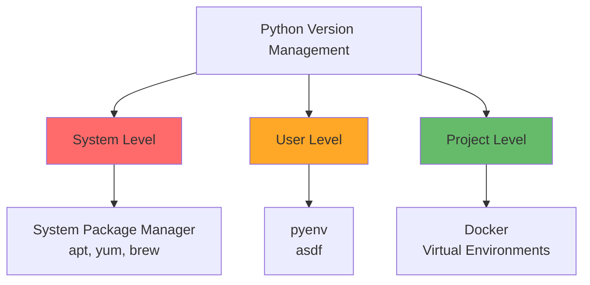
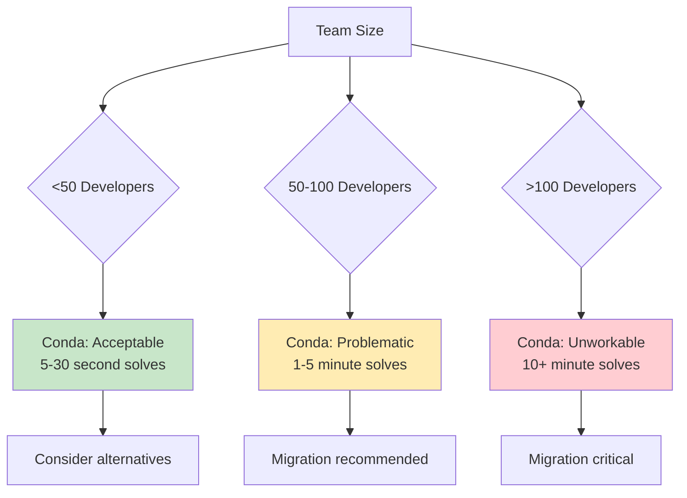

# Environment Management

### Python Version Management



### pyenv: Python Version Management

```bash
# Install multiple Python versions
pyenv install 3.11.7
pyenv install 3.12.1

# Set global default
pyenv global 3.11.7

# Set project-specific version
cd /path/to/project
pyenv local 3.12.1  # Creates .python-version file

# List available versions
pyenv versions
```

### Virtual Environment Strategies

| Method | Pros | Cons | Best For |
|--------|------|------|----------|
| **venv** | Built-in, simple | Manual management | Simple projects |
| **poetry** | Automatic, integrated | Learning curve | Development workflow |
| **uv** | Fast, modern | Newer tool | Performance-critical |
| **conda** | Scientific packages | Performance issues at scale | Data science <100 devs |
| **Docker** | Complete isolation | Resource overhead | Production, complex deps |

### Conda: Critical Scale Limitations (2024-2025 Update)

#### Performance Degradation at Scale

Conda reveals significant limitations for teams exceeding **100 developers**:



#### Technical Issues at Scale

| Problem | Impact | Alternative Solution |
|---------|--------|-----------------|
| **SAT-based solver** | 10+ minute resolution times | uv's fast resolver (seconds) |
| **Mixed pip/conda** | Invisible dependency conflicts | Pure pip/uv workflows |
| **Environment size** | 5x larger than venv | Lightweight virtual environments |
| **Channel conflicts** | conda-forge vs bioconda issues | PyPI's unified ecosystem |
| **Storage costs** | Multiplied across many developers | Shared cache in uv/Poetry |

#### When Conda Still Makes Sense

- **Individual developers** or small teams (<50 people)
- **Heavy scientific computing** with complex C dependencies  
- **Multi-language environments** (Python + R + Julia)
- **Academic/educational** environments
- **Legacy scientific workflows** with established conda recipes

### Docker for Python Applications

```dockerfile
# Dockerfile for Python application
FROM python:3.11-slim as base

# Set environment variables
ENV PYTHONUNBUFFERED=1 \
    PYTHONDONTWRITEBYTECODE=1 \
    PIP_NO_CACHE_DIR=1 \
    PIP_DISABLE_PIP_VERSION_CHECK=1

# Create non-root user
RUN groupadd --gid 1000 appuser \
    && useradd --uid 1000 --gid appuser --shell /bin/bash --create-home appuser

# Install system dependencies
RUN apt-get update \
    && apt-get install -y --no-install-recommends \
        build-essential \
        libpq-dev \
    && rm -rf /var/lib/apt/lists/*

# Install uv for faster dependency installation
COPY --from=ghcr.io/astral-sh/uv:latest /uv /bin/uv

# Development stage
FROM base as development
WORKDIR /app
COPY pyproject.toml uv.lock ./
RUN uv sync --dev
COPY . .
USER appuser
CMD ["uv", "run", "python", "-m", "myapp"]

# Production stage
FROM base as production
WORKDIR /app
COPY pyproject.toml uv.lock ./
RUN uv sync --no-dev
COPY . .
USER appuser
EXPOSE 8000
CMD ["uv", "run", "uvicorn", "myapp.main:app", "--host", "0.0.0.0", "--port", "8000"]
```
