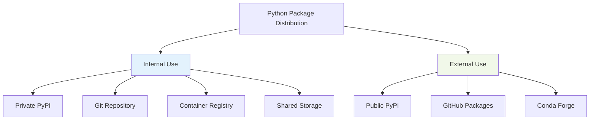

# Deployment & Distribution

### Distribution Strategies



### On-Premise Environment Considerations

At Taboola, you likely have:

1. **Restricted Internet Access**
   - Internal PyPI mirror
   - Approved package whitelist
   - Security scanning requirements

2. **Corporate Policies**
   - License compliance checks
   - Vulnerability scanning
   - Audit trails

3. **Infrastructure Constraints**
   - Specific Python versions
   - Limited compute resources
   - Network restrictions

```bash
# Example: Using internal PyPI
pip install --index-url https://pypi.internal.taboola.com/simple/ \
           --trusted-host pypi.internal.taboola.com \
           my-package
```

### CI/CD Pipeline Example

```yaml
# .github/workflows/python-package.yml
name: Python Package

on: [push, pull_request]

jobs:
  test:
    runs-on: ubuntu-latest
    strategy:
      matrix:
        python-version: ["3.11", "3.12"]

    steps:
    - uses: actions/checkout@v4

    - name: Install uv
      uses: astral-sh/setup-uv@v1

    - name: Set up Python ${{ matrix.python-version }}
      run: uv python install ${{ matrix.python-version }}

    - name: Install dependencies
      run: uv sync --all-extras

    - name: Run linting
      run: |
        uv run ruff check .
        uv run black --check .
        uv run mypy .

    - name: Run tests
      run: uv run pytest --cov=src --cov-report=xml

    - name: Upload coverage
      uses: codecov/codecov-action@v3

  build:
    needs: test
    runs-on: ubuntu-latest
    steps:
    - uses: actions/checkout@v4
    - name: Install uv
      uses: astral-sh/setup-uv@v1
    - name: Build package
      run: uv build
    - name: Upload artifacts
      uses: actions/upload-artifact@v3
      with:
        name: dist
        path: dist/

  publish:
    needs: build
    runs-on: ubuntu-latest
    if: startsWith(github.ref, 'refs/tags/')
    steps:
    - name: Download artifacts
      uses: actions/download-artifact@v3
    - name: Publish to PyPI
      run: |
        uv publish --token ${{ secrets.PYPI_TOKEN }}
```
